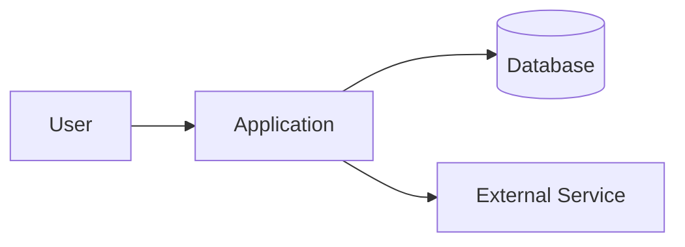
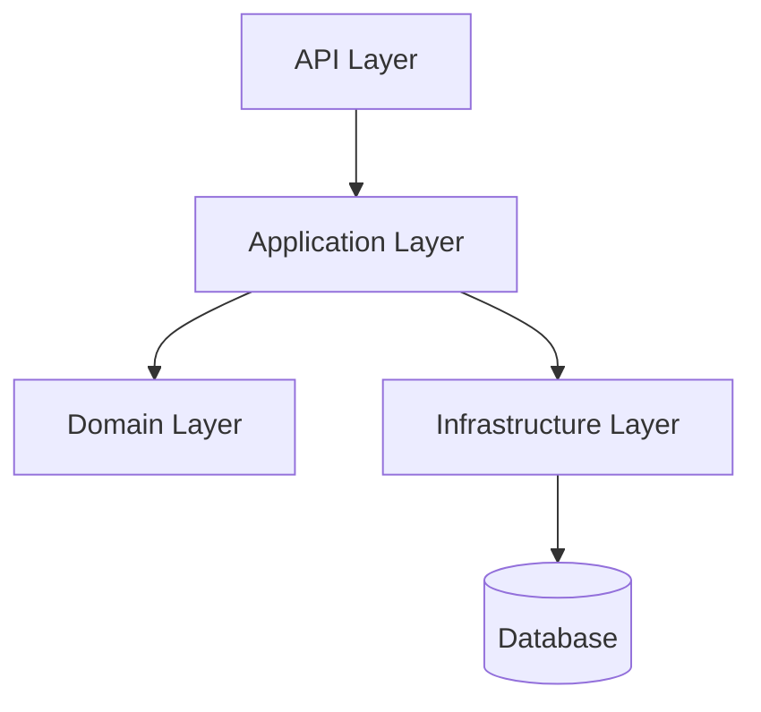
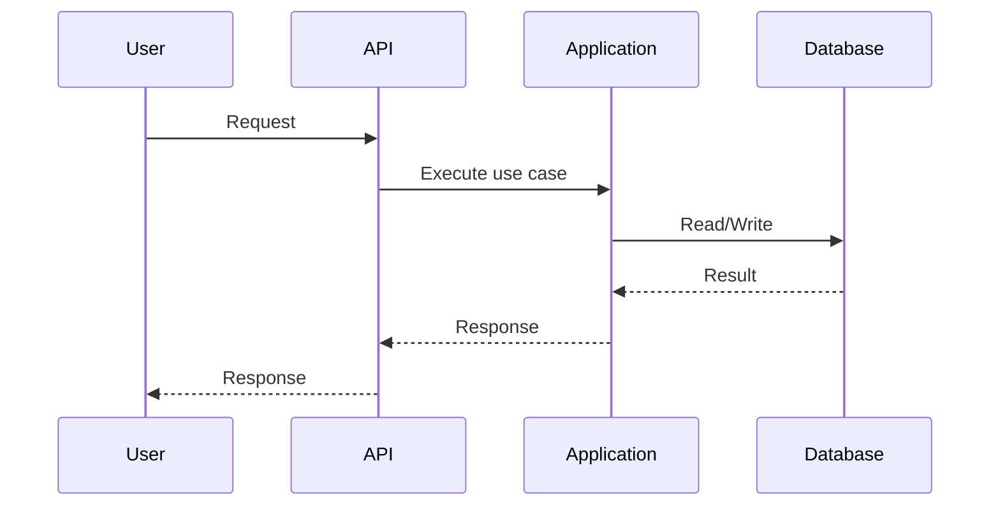
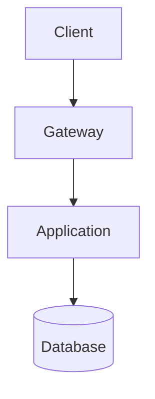

# System Architecture Template

Use this template when creating a full architecture document. Delete sections that are not applicable, but do not silently omit unknown areas; mark them as `Unknown` or `Not applicable`.

```markdown
# Tài liệu kiến trúc hệ thống: <System Name>

## 1. Executive Summary

<System Name> dùng để <business purpose>.

| Hạng mục | Thông tin |
| --- | --- |
| Scope | <whole system/service/module/workflow> |
| Primary users | <users/actors> |
| Architecture style | <Confirmed/Inferred/Unknown> |
| Backend | <stack> |
| Frontend | <stack or Not applicable> |
| Database | <database> |
| Cache | <cache or Not applicable> |
| Queue/Event | <queue/event bus or Not applicable> |
| Deployment | <Docker/Kubernetes/IIS/VM/cloud/Unknown> |
| Observability | <logs/metrics/traces/health checks/Unknown> |

## 2. Purpose and Scope

### Business Purpose

- <capability/problem solved>
- <capability/problem solved>

### Documentation Scope

Included:

- <included area>

Excluded:

- <excluded area>

### Audience

- <developer/tester/BA/DevOps/security/manager/AI agent>

## 3. Evidence Summary

| Claim | Confidence | Evidence |
| --- | --- | --- |
| <claim> | Confirmed/Inferred/Assumption/Unknown | <file/path or reason> |

## 4. System Context



## 5. Architecture Overview

### Architecture Style

Current classification: `<style>`.

Rationale:

- Confirmed: <evidence>
- Inferred: <evidence>
- Unknown: <missing info>

### Component View



| Component | Responsibility | Technology | Evidence |
| --- | --- | --- | --- |
| <component> | <responsibility> | <technology> | <file/path> |

## 6. Codebase Structure

```text
<relevant tree>
```

| Path / Module | Responsibility | Notes |
| --- | --- | --- |
| `<path>` | <responsibility> | <notes> |

## 7. Runtime Flows

### Main Flow: <Use Case>



| Step | Component | Action | Evidence / Notes |
| --- | --- | --- | --- |
| 1 | <component> | <action> | <evidence> |

## 8. Data Architecture

| Data store / Entity | Purpose | Owner | Consistency / Retention | Evidence |
| --- | --- | --- | --- | --- |
| <table/db/entity> | <purpose> | <owner> | <notes> | <file/path> |

Unknowns:

- <missing schema/migration/retention detail>

## 9. API and Integration

| Method / Event | Endpoint / Topic | Consumer | Provider | Auth | Notes |
| --- | --- | --- | --- | --- | --- |
| <method> | <endpoint> | <consumer> | <provider> | <auth> | <notes> |

Integration risks:

- <risk>

## 10. Security Architecture

| Area | Current state | Risk | Evidence |
| --- | --- | --- | --- |
| Authentication | <state> | <risk> | <evidence> |
| Authorization | <state> | <risk> | <evidence> |
| Secrets | <state> | <risk> | <evidence> |
| Sensitive data | <state> | <risk> | <evidence> |
| Tenant isolation | <state> | <risk> | <evidence> |

## 11. Deployment Architecture



| Environment | Runtime | Config source | Notes |
| --- | --- | --- | --- |
| Local | <runtime> | <config> | <notes> |
| Test | <runtime> | <config> | <notes> |
| Production | <runtime> | <config> | <notes> |

## 12. Observability

| Area | Current state | Gap / Recommendation | Evidence |
| --- | --- | --- | --- |
| Logging | <state> | <gap> | <evidence> |
| Metrics | <state> | <gap> | <evidence> |
| Tracing | <state> | <gap> | <evidence> |
| Health checks | <state> | <gap> | <evidence> |
| Alerts / dashboards | <state> | <gap> | <evidence> |

## 13. Non-functional Requirements

| Requirement | Target | Current evidence | Gap |
| --- | --- | --- | --- |
| Performance | <target> | <evidence> | <gap> |
| Availability | <target> | <evidence> | <gap> |
| Scalability | <target> | <evidence> | <gap> |
| Maintainability | <target> | <evidence> | <gap> |
| Security | <target> | <evidence> | <gap> |

## 14. Risks and Technical Debt

| Priority | Risk | Impact | Recommendation |
| --- | --- | --- | --- |
| High/Medium/Low | <risk> | <impact> | <recommendation> |

## 15. Recommendations

### High

- <recommendation>

### Medium

- <recommendation>

### Low

- <recommendation>

## 16. Open Questions

| Question | Owner | Impact |
| --- | --- | --- |
| <question> | <owner> | High/Medium/Low |

## 17. Suggested ADRs

| ADR | Decision | Why it matters | Status |
| --- | --- | --- | --- |
| ADR-001 | <decision> | <reason> | Proposed |
```
