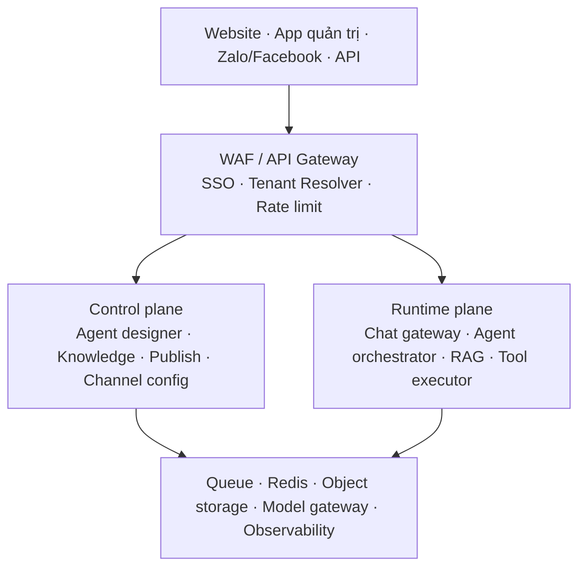
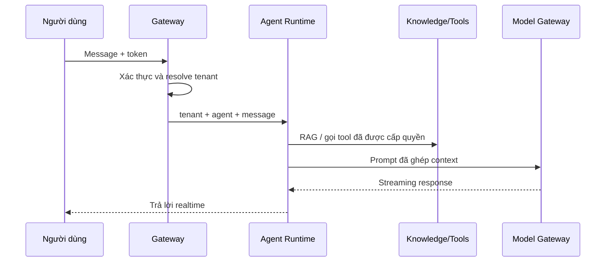

Nên định vị đây là một **nền tảng AI Agent đa tenant**, không chỉ là chatbot: quản trị agent, nạp tri thức, chạy thử, phát hành đa kênh và tích hợp nghiệp vụ. Đây cũng là các luồng công khai Agentwork mô tả: tạo nhân viên AI → huấn luyện → chạy thử → phát hành lên Website/Facebook/Zalo; kèm các nghiệp vụ như tư vấn, bán hàng, kế toán, nhân sự và điều hành.

Điểm quan trọng: kiến trúc “MySQL database-per-tenant + PostgreSQL shared” phù hợp, nhưng PostgreSQL shared phải là **control plane + runtime catalog**, không được trở thành một nơi đọc dữ liệu xuyên tenant không kiểm soát.



## 1. Chia miền dữ liệu

| Vùng                    | Database                                                         | Dữ liệu nên chứa                                                                                                                                       | Nguyên tắc                                            |
| ----------------------- | ---------------------------------------------------------------- | ------------------------------------------------------------------------------------------------------------------------------------------------------ | ----------------------------------------------------- |
| Tenant operational data | MySQL, **một database mỗi tenant**                               | Agent draft, knowledge source metadata, cấu hình kênh, hội thoại, lịch sử thao tác, quyền nội bộ, dữ liệu nghiệp vụ riêng                              | Cô lập vật lý theo database                           |
| Shared control plane    | PostgreSQL                                                       | Tenant registry, global identity/membership, catalog agent mẫu, plugin/tool registry, gói dịch vụ, feature flags, publishing manifest, audit tập trung | Mọi bảng có `tenant_id` nếu chứa dữ liệu tenant       |
| Shared runtime catalog  | PostgreSQL                                                       | Agent đã phát hành, phiên bản, routing rule, policy, tool allow-list, trạng thái deploy                                                                | Agent vẫn phải mang `owner_tenant_id`/phạm vi chia sẻ |
| File & knowledge gốc    | S3/MinIO                                                         | PDF, DOCX, ảnh, file import, bản export                                                                                                                | Không lưu binary trong DB                             |
| Vector search           | PostgreSQL + pgvector lúc đầu, hoặc vector DB riêng khi tăng tải | Chunk + embedding tri thức                                                                                                                             | Bắt buộc lọc `tenant_id` trước/sau vector search      |

### Quy tắc cho Agent Runtime

Khi tenant A bấm **Phát hành** agent:

1. Lưu agent draft và tri thức riêng ở `mysql_tenant_A`.
2. Tạo event `agent.published` qua outbox.
3. Worker tạo một **immutable runtime snapshot** trong PostgreSQL.
4. Snapshot có `tenant_id`, `agent_id`, `version`, `visibility`, `policy_version`, `status`.
5. Runtime chỉ tải snapshot đúng tenant và đúng version; có thể rollback nhanh.

Không nên hiểu “publish sang shared DB” là mọi tenant đều đọc được agent đó. Mặc định phải là:

```text
agent_runtime.owner_tenant_id = current_tenant_id
visibility = PRIVATE
```

Chỉ agent template/chợ ứng dụng mới có `PUBLIC` hoặc `SHARED_TO_SELECTED_TENANTS`.

## 2. Tenant resolution

Mỗi request phải xác định tenant tại gateway từ:

* Domain/subdomain: `tenant-a.yourdomain.com`
* Claim trong JWT/SSO: `tenant_id`, `workspace_id`
* Với API server-to-server: API key gắn cố định với tenant

Không tin `tenantId` từ body do client gửi. Gateway đối chiếu identity và membership, rồi truyền tenant context nội bộ.

PostgreSQL nên có bảng registry kiểu:

```text
tenant_registry
- tenant_id
- status
- mysql_cluster_id
- mysql_database_name
- schema_version
- plan_code
- region
```

Như vậy khi mở rộng, bạn có thể đưa tenant mới sang MySQL cluster khác mà không đổi code. Đừng gắn cứng “một server MySQL chứa tất cả tenant”.

## 3. Các module nghiệp vụ cần có

* **Identity & Tenant**: SSO, tổ chức, thành viên, role, subscription, provisioning tenant.
* **Agent Studio**: tạo agent, prompt/system instruction, persona, kịch bản, version draft.
* **Knowledge Service**: upload, OCR/parser, chunking, embedding, re-index, xóa theo retention.
* **Simulation/Test Lab**: chạy thử agent với dữ liệu test, lưu trace và đánh giá câu trả lời.
* **Publishing & Channel**: phát hành/rollback, web widget, Zalo/Facebook, API, cấu hình webhook.
* **Conversation Runtime**: nhận message, quản lý session, streaming response, handoff sang người thật.
* **Agent Orchestrator**: chọn agent/version, RAG, gọi LLM, gọi tool/workflow, trả lời.
* **Tool & Workflow Hub**: chuẩn hóa kết nối CRM, ERP, lịch, ticket, tra cứu; phân quyền theo từng tool.
* **Usage/Billing**: token, số cuộc hội thoại, quota, rate limit, hóa đơn.
* **Audit & Admin**: toàn bộ publish, đổi cấu hình, gọi tool, truy cập dữ liệu nhạy cảm.

## 4. Luồng chat lúc chạy thực tế



* Web/app client dùng WebSocket hoặc SignalR cho streaming và realtime.
* Redis chỉ phục vụ cache session, rate limit, distributed lock và SignalR backplane; không thay thế database.
* Các tác vụ chậm như OCR, embedding, đồng bộ Facebook/Zalo, gửi thông báo dùng queue + worker.
* Dùng **outbox pattern** cho publish, billing event, index knowledge để tránh ghi DB thành công nhưng mất event.

## 5. Bảo mật và cách ly tenant

Đây là phần quyết định sản phẩm có thể bán cho doanh nghiệp hay không:

* Mọi query shared PostgreSQL đều có `tenant_id`; bật Row-Level Security nếu dùng chung bảng.
* RAG luôn filter theo `tenant_id`, `agent_id`, knowledge scope trước khi tìm vector.
* Token kết nối Zalo/Facebook/API, khóa LLM và secret tích hợp phải ở Vault/Secret Manager, không lưu plaintext trong MySQL/PostgreSQL.
* Tool execution dùng allow-list theo agent/version; tool tạo đơn, gửi mail, cập nhật dữ liệu cần scope hẹp và audit.
* Có quota theo tenant: request/phút, concurrent chat, token/ngày, dung lượng tri thức.
* Có audit trail bất biến cho: publish, rollback, đổi prompt, upload/xóa tri thức, tool call.
* Chống prompt injection: tách system prompt, retrieved context và tool instruction; không cho tri thức tự ý thay policy hay quyền gọi tool.

## 6. Hạ tầng nên bổ sung

* **API Gateway/WAF**: auth, quota, routing, chống abuse.
* **Model Gateway**: một lớp gọi OpenAI/Claude/Gemini/model nội bộ; quản lý fallback, timeout, cost, retry và redaction.
* **Message broker**: RabbitMQ lúc đầu hoặc Kafka nếu lượng event/log lớn.
* **Redis**: cache, session, lock, realtime backplane.
* **Object storage**: S3/MinIO cho file tri thức và export.
* **OpenTelemetry + Elasticsearch**: trace theo `tenant_id`, `agent_id`, `conversation_id`, `trace_id`; tránh log prompt/PII nguyên văn mặc định.
* **Analytics store**: ban đầu PostgreSQL aggregate; khi nhiều event thì ClickHouse/warehouse riêng.

## 7. Cách triển khai hợp lý

Đừng tách microservice ngay. Với giai đoạn đầu, nên làm **modular monolith .NET + background workers + queue**, nhưng tách ranh giới module rõ như trên. Các phần nên tách service sớm khi tải tăng là:

1. Chat/Agent Runtime
2. Knowledge ingestion & vector indexing
3. Channel connector/webhook
4. Model Gateway
5. Analytics/usage

MVP nên chỉ gồm: tenant provisioning, Agent Studio, knowledge upload, test chat, publish web widget, runtime RAG, version/rollback, RBAC, audit và usage cơ bản. Sau đó mới mở Zalo/Facebook, workflow tự động và các tool nghiệp vụ.

Mấu chốt kiến trúc là: **MySQL bảo vệ dữ liệu gốc từng tenant; PostgreSQL làm registry và bản runtime đã phát hành; runtime chỉ đọc snapshot có scope tenant rõ ràng; mọi đồng bộ giữa hai vùng đi qua event/outbox.**
