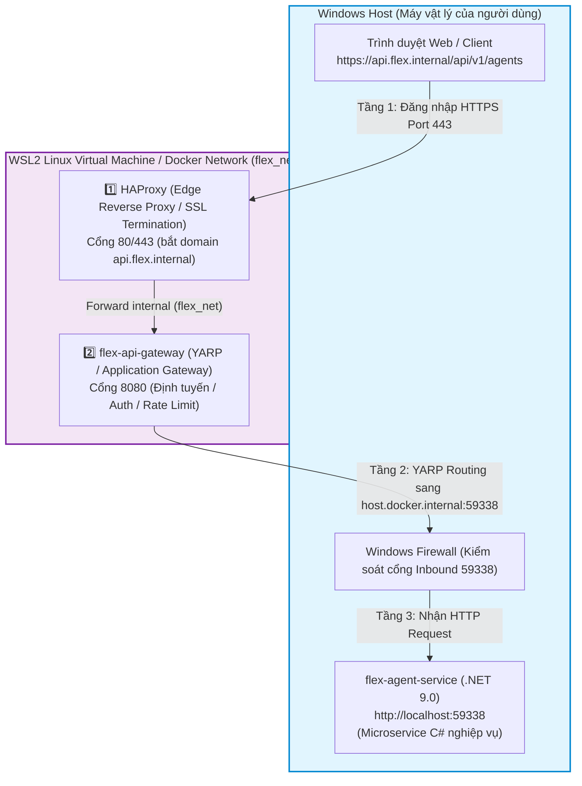
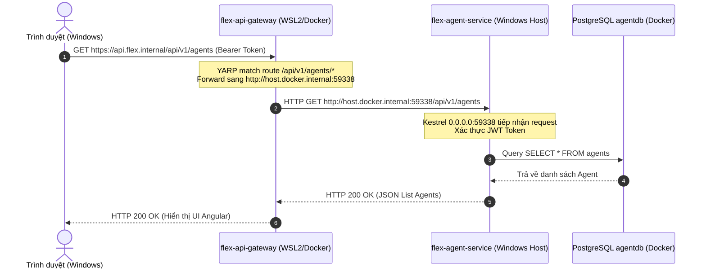

# Kiến trúc Mạng & Topology: Windows Host vs WSL2 / Docker

Tài liệu này mô tả chi tiết sơ đồ mạng, ranh giới giao tiếp và cách giải quyết xung đột kết nối giữa **Windows Host** và **WSL2 / Docker Container**.

---

## 1. Sơ đồ Topology Chi tiết (3 Tầng Mạng)



---

## 2. Giải thích lý do xảy ra lỗi `502 Bad Gateway (Timeout)`

### 🔴 Bản chất vấn đề 1: Phân tách Loopback (`127.0.0.1`)
- **Trong Windows**: `localhost` (`127.0.0.1`) là giao diện mạng nội bộ của Windows.
- **Trong WSL2**: WSL2 là một máy ảo Linux (Hyper-V / WSL2 Lightweight VM) có dải IP ảo riêng. `localhost` trong WSL2 là của Linux, **KHÔNG PHẢI** `localhost` của Windows.

### 🔴 Bản chất vấn đề 2: Kestrel Binding trên Windows
- Khi chạy `flex-agent-service` trên Windows với cấu hình mặc định `"applicationUrl": "http://localhost:59338"`, Kestrel C# chỉ lắng nghe duy nhất cổng `127.0.0.1:59338`.
- Khi `flex-api-gateway` chạy trong WSL2 trỏ tới IP của Windows (ví dụ `192.168.1.44` hoặc `host.docker.internal`), gói tin mạng xuất phát từ WSL2 đi vào card mạng Windows với IP nguồn dạng `172.x.x.x` hoặc `192.168.x.x`.
- Vì Kestrel chỉ nhận packet tới `127.0.0.1`, nó lập tức từ chối/bỏ qua packet đến từ WSL2 $\rightarrow$ Sinh lỗi **Connection Timed Out / 502 Bad Gateway**.

### 🔴 Bản chất vấn đề 3: Windows Firewall
- Tường lửa Windows (Windows Defender Firewall) mặc định chặn các kết nối đến từ adapter mạng ảo WSL2 vào các port chưa được mở (inbound rule).

---

## 3. Các Phương án Xử lý (Solution Options)

### 🟢 Phương án A: Cho phép `flex-agent-service` lắng nghe từ WSL2 (Khuyên dùng khi chạy hybrid)

#### Bước 1: Sửa Kestrel binding trong `launchSettings.json`
Thay đổi `applicationUrl` từ `localhost` thành `0.0.0.0` (nghe tất cả card mạng):

```json
{
  "profiles": {
    "Flex.Agent": {
      "commandName": "Project",
      "launchBrowser": false,
      "environmentVariables": {
        "ASPNETCORE_ENVIRONMENT": "Development"
      },
      "applicationUrl": "http://0.0.0.0:59338"
    }
  }
}
```

#### Bước 2: Thêm Inbound Rule cho Windows Firewall
Mở PowerShell (Run as Administrator) trên Windows và chạy lệnh cho phép cổng `59338`:

```powershell
New-NetFirewallRule -DisplayName "Allow Agent Service for WSL" -Direction Inbound -LocalPort 59338 -Protocol TCP -Action Allow
```

---

### 🟢 Phương án B: Chạy `flex-agent-service` trực tiếp trong WSL2 hoặc Docker Container (Đồng bộ 100% môi trường)

Nếu đưa `flex-agent-service` vào cùng mạng Docker/WSL2 với API Gateway:
- Cả hai service cùng thuộc mạng `flex_net`.
- API Gateway gọi trực tiếp tới `http://flex-agent-service:8080/` qua DNS nội bộ của Docker.
- Không bị vướng ranh giới Windows/WSL2 Firewall.

---

## 4. Sơ đồ luồng giao tiếp sau khi khắc phục


