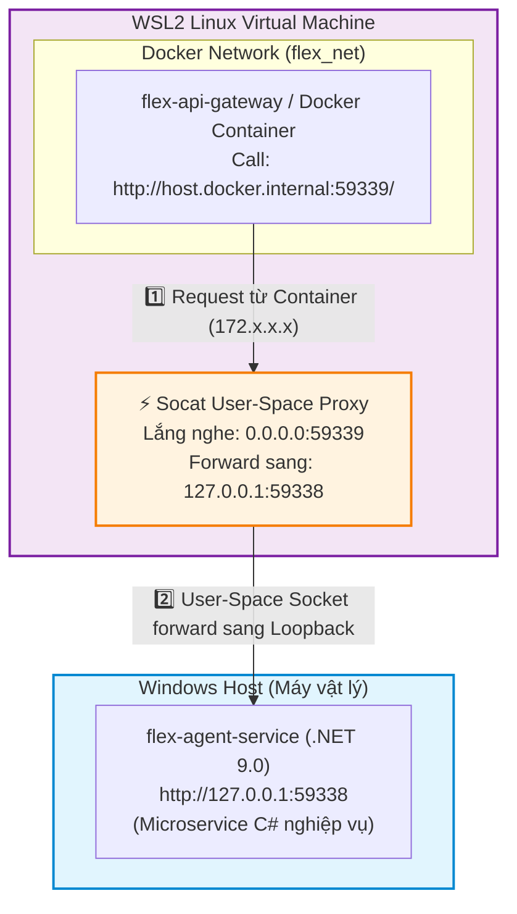
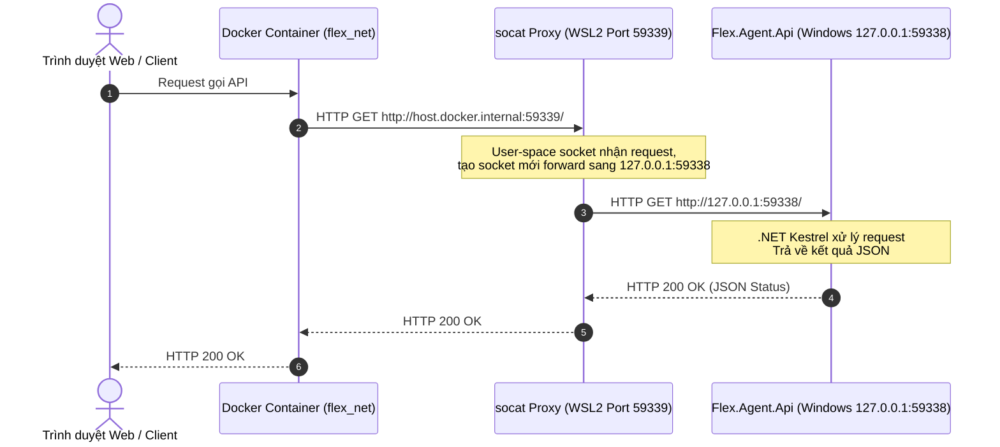

# Kiến trúc Mạng & Topology: Windows Host vs WSL2 / Docker

Tài liệu này mô tả chi tiết sơ đồ mạng, ranh giới giao tiếp và giải pháp kết nối giữa **Windows Host** (ứng dụng .NET) và **WSL2 / Docker Container** trong môi trường `networkingMode=mirrored`.

---

## 1. Sơ đồ Topology Chi tiết (3 Tầng Mạng qua Socat Proxy)



---

## 2. Giải thích Bản chất Sự cố Treo (Hang/Timeout) trong WSL2 `mirrored` Mode

### 🔴 Nguyên nhân 1: Cơ chế bảo mật Routing của Linux Kernel khi `networkingMode=mirrored`
- Khi WSL2 bật `networkingMode=mirrored`, port của Windows (`59338`) được mirror trực tiếp vào namespace của WSL2 Linux VM.
- Khi Docker Container thuộc card mạng ảo bridge (`172.x.x.x` / `flex_net`) gửi gói tin tới host và bị `iptables` nat ép nhảy trực tiếp vào giao diện loopback `127.0.0.1`, Kernel Linux của WSL2 chủ động hủy (drop) các gói tin này vì lý do bảo mật routing (martian packet filtering). Kết quả là connection bị treo (hang/timeout).

### 🔴 Nguyên nhân 2: Xung đột Port Binding
- Ứng dụng .NET trên Windows đã chiếm giữ port `59338` (được mirror vào WSL2).
- Do đó, các công cụ proxy như `socat` không thể bind trực tiếp đè lên port `59338` bên trong WSL2.

---

## 3. Giải pháp Triệt để: User-Space Proxy (`socat` trên Port phụ 59339)

Bằng cách chạy `socat` trên một **port phụ (`59339`)** ở WSL2, `socat` chạy ở tầng ứng dụng (user-space) nhận request từ Docker bridge và tự tạo một socket mới đẩy sang `127.0.0.1:59338`. Cách này vượt qua hoàn toàn rào cản routing ở cấp Kernel!

---

### Bước 1: Làm sạch các rule `iptables` nat cũ

Mở **Terminal WSL2** và chạy các lệnh dọn dẹp:

```bash
sudo iptables -t nat -F
sudo iptables -t nat -X
```

---

### Bước 2: Khởi chạy `socat` chạy ngầm vĩnh viễn (Tự động hóa qua Systemd)

Bạn có thể khởi chạy thủ công:
```bash
nohup socat TCP-LISTEN:59339,fork,reuseaddr TCP:127.0.0.1:59338 > /dev/null 2>&1 &
```

Hoặc **tự động hóa 100% qua Systemd Service** (đã được tích hợp sẵn trong script [`scripts/ensure-wsl-proxy.ps1`](file:///c:/Workspace/Project/flex-workstation/scripts/ensure-wsl-proxy.ps1) thuộc quy trình bootstrap):

```bash
# File service tự động tại: /etc/systemd/system/flex-socat-proxy.service
sudo systemctl enable --now flex-socat-proxy
```

> 📌 **Giải thích:**
> - `TCP-LISTEN:59339,fork,reuseaddr`: Lắng nghe trên port 59339 của WSL2, cho phép nhiều kết nối đồng thời.
> - `TCP:127.0.0.1:59338`: Chuyển tiếp toàn bộ request sang ứng dụng .NET đang nghe ở `127.0.0.1:59338`.
> - Systemd service đảm bảo `socat` tự động chạy mỗi khi bật WSL2 và tự động khôi phục nếu bị crash.

---

### Bước 3: Kiểm tra kết nối từ Docker Container

Từ bên trong Container (hoặc qua Portainer Terminal):

```bash
wget -qO- http://host.docker.internal:59339/
# hoặc
curl http://host.docker.internal:59339/
```

**Kết quả thành công:** Trả về JSON status của `Flex.Agent.Api` ngay lập tức:
```json
{"status":"Up","name":"Flex.Agent.Api", ...}
```

---

## 4. Cấu hình Sử dụng chính thức

Sau khi test thành công, chọn một trong hai phương án cấu hình:

### 🟢 Lựa chọn A: Đổi Port gọi trong `docker-compose.yml` (Khuyên dùng - Cleanest)

Cập nhật URL cấu hình của service trong `docker-compose.yml` (hoặc file environment):

```yaml
environment:
  - AGENT_SERVICE_URL=http://host.docker.internal:59339/
```

---

### 🟢 Lựa chọn B: Giữ nguyên Port `59338` trong Config Container

Nếu giữ nguyên URL `http://host.docker.internal:59338/` trong config của container, thêm 1 rule `iptables` duy nhất trên WSL2 để redirect port `59338` từ Docker bridge sang port phụ `59339`:

```bash
sudo iptables -t nat -A PREROUTING -p tcp --dport 59338 -j REDIRECT --to-ports 59339
```

---

## 5. Sơ đồ Luồng Giao tiếp sau khi Khắc phục



