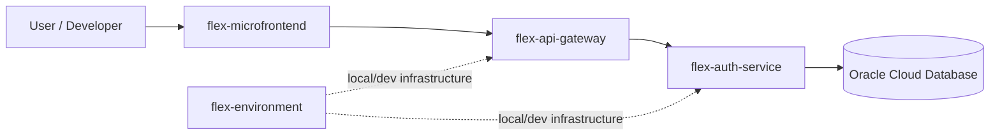
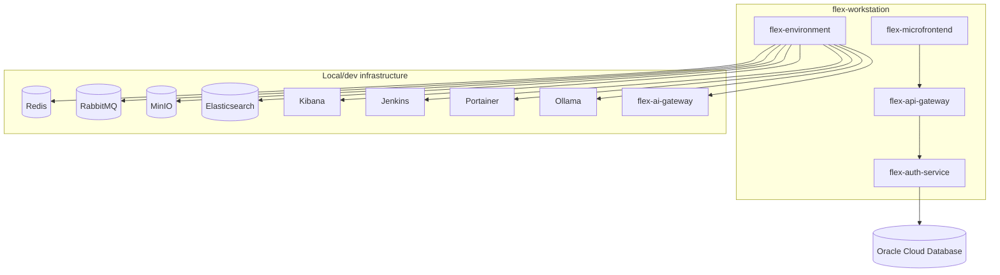

# Tổng quan kiến trúc hệ thống Flex

Tài liệu này mô tả các thành phần chính của workstation ở mức platform/container. Chi tiết nội bộ từng service nên nằm trong `docs/` của repo tương ứng.

## 1. Scope

| Hạng mục | Trạng thái |
| --- | --- |
| Scope | Workstation Flex (`flex-workstation`) |
| Audience | Developer, DevOps, security reviewer, AI agent |
| Architecture style | `Inferred`: multi-repo platform gồm frontend, gateway, backend service và environment stack |
| Primary database | `Confirmed by user`: Oracle Cloud Database |
| Local infrastructure | `Confirmed`: `flex-environment/docker-compose.yml` và `docker-compose.override.yml` |

## 2. System Context

## 3. Thành phần hệ thống

| Thành phần | Vai trò | Trạng thái | Evidence |
| --- | --- | --- | --- |
| `flex-workstation` | Repo điều phối workspace, tài liệu, bootstrap, template, skill source và AI tooling. | `Confirmed` | `flex-workstation/README.md`, `flex-workstation/docs/system-map.md` |
| `flex-microfrontend` | Frontend client. README hiện ghi yêu cầu Node.js, Angular CLI và lệnh `ng serve`. | `Confirmed` | `flex-microfrontend/README.md`, `flex-microfrontend/package.json` |
| `flex-api-gateway` | API Gateway cho nhóm service Flex. | `Inferred` | `flex-api-gateway/Flex.ApiGateway.sln`, `flex-api-gateway/Dockerfile`, `flex-api-gateway/Jenkinsfile` |
| `flex-auth-service` | Service xác thực/ủy quyền. | `Inferred` | `flex-auth-service/Flex.Auth.sln`, `flex-auth-service/SPEC.md`, `flex-auth-service/Dockerfile` |
| `flex-environment` | Stack hạ tầng local/dev: Redis, RabbitMQ, Jenkins, Portainer, MinIO, Elasticsearch, Kibana, Ollama, `flex-ai-gateway`. | `Confirmed` | `flex-environment/docker-compose.yml`, `flex-environment/docker-compose.override.yml` |
| `.claude` | Runtime config/skills/agents/commands cho Claude Code tại workstation project root. | `Confirmed` | `flex-workstation/docs/system-map.md` |
| `.agents` | Runtime skills/agents/commands cho Codex tại workstation project root. | `Confirmed` | `flex-workstation/docs/system-map.md` |

## 4. Data Architecture

| Data store | Vai trò | Trạng thái | Evidence / ghi chú |
| --- | --- | --- | --- |
| Oracle Cloud Database | Primary database hiện tại của hệ thống. | `Confirmed by user` | User xác nhận ngày 2026-06-18: "hiện tại DB đang sử dụng oracle cloud". |
| Oracle local container | Local Oracle DB từng được khai báo nhưng hiện đang comment out. | `Confirmed` | `flex-environment/docker-compose.yml`, `flex-environment/docker-compose.override.yml` có `securitiesdb` bị comment. |
| Redis | Cache/local infrastructure. | `Confirmed` | `flex-environment/docker-compose.yml` khai báo `redisdb`. |
| RabbitMQ | Message broker/local infrastructure. | `Confirmed` | `flex-environment/docker-compose.yml` khai báo `rabbitmq`. |
| MinIO | Object storage/local infrastructure. | `Confirmed` | `flex-environment/docker-compose.yml` khai báo `minio`. |
| Elasticsearch + Kibana | Search/analytics và UI quan sát dữ liệu log/search. | `Confirmed` | `flex-environment/docker-compose.yml` khai báo `elasticsearch`, `kibana`. |

## 5. Deployment / Runtime View

## 6. Rủi ro và điểm cần xác minh

| Priority | Vấn đề | Tác động | Khuyến nghị |
| --- | --- | --- | --- |
| High | Chi tiết kết nối Oracle Cloud chưa được tài liệu hóa ở mức architecture. | DevOps/security khó xác minh wallet, secret, network access và rotation. | Bổ sung tài liệu riêng về Oracle Cloud connectivity, không ghi secret vào repo. |
| Low | Danh sách repo cần được giữ đồng bộ khi thêm/bớt project trong workstation. | AI agent hoặc developer mới có thể hiểu thiếu thành phần nếu tài liệu cũ. | Cập nhật `docs/projects.md` và file này khi thay đổi repo trong workstation. |
| Medium | Quan hệ runtime giữa `flex-api-gateway`, `flex-auth-service` và Oracle Cloud mới ở mức inferred/user-confirmed. | Dễ nhầm giữa ý định kiến trúc và cấu hình triển khai thực tế. | Bổ sung evidence từ app config, connection factory hoặc deployment config của từng service. |

## 7. Open Questions

| Câu hỏi | Owner | Impact |
| --- | --- | --- |
| Service nào trực tiếp kết nối Oracle Cloud: `flex-auth-service`, `flex-api-gateway`, hay service khác? | Backend/DevOps | High |
| Oracle Cloud đang dùng Autonomous Database, Base Database Service hay loại khác? | DevOps | Medium |
| Wallet/secret được cấp phát và rotate theo quy trình nào? | DevOps/Security | High |
| `flex-environment` là local-only hay cũng đại diện cho staging/prod topology? | DevOps | Medium |

## 8. Suggested ADRs

| ADR | Decision | Why it matters | Status |
| --- | --- | --- | --- |
| ADR-001 | Dùng Oracle Cloud Database làm primary database | Ảnh hưởng connection, wallet/secret, backup, migration và local development strategy. | Proposed |
