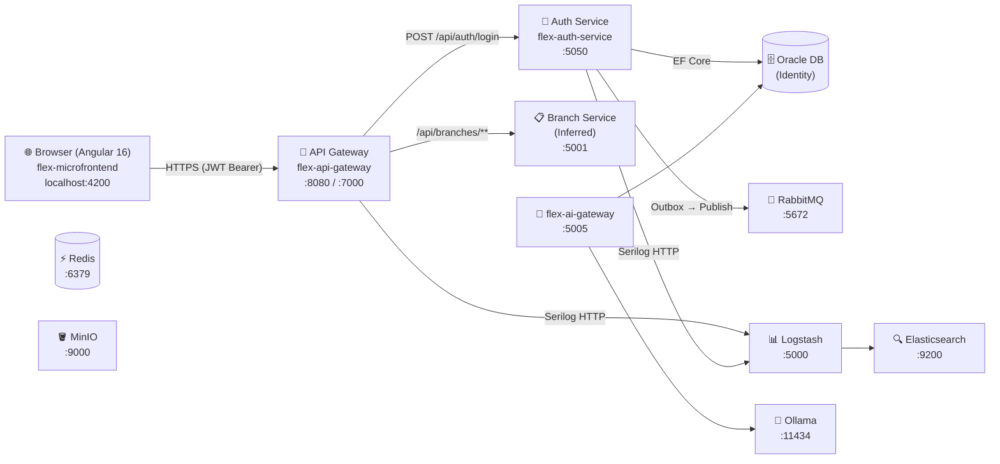
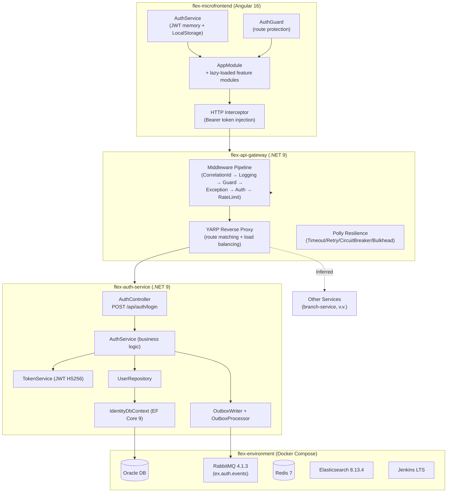
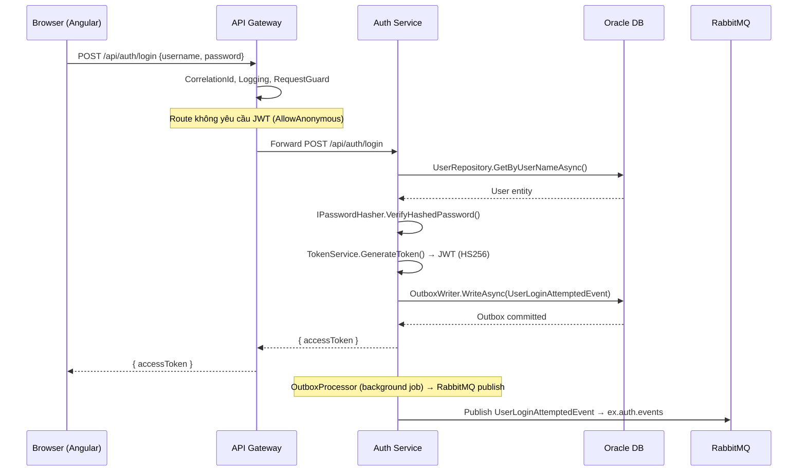
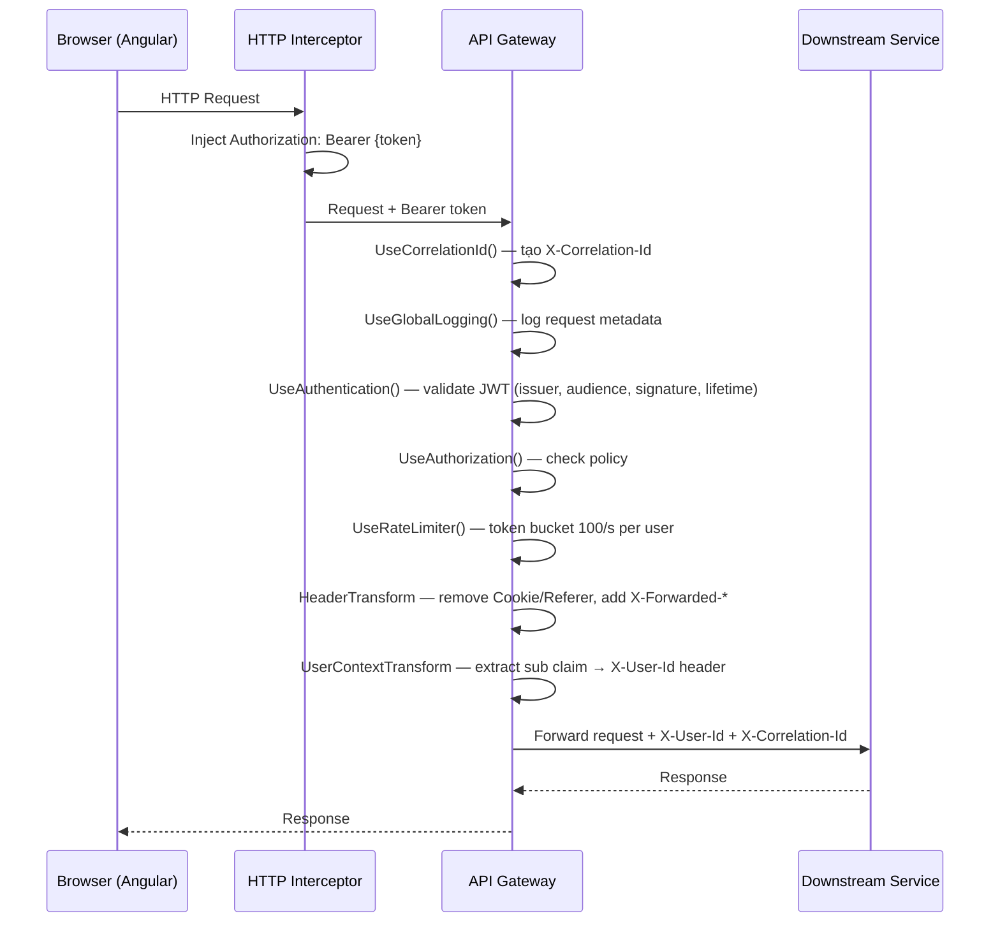
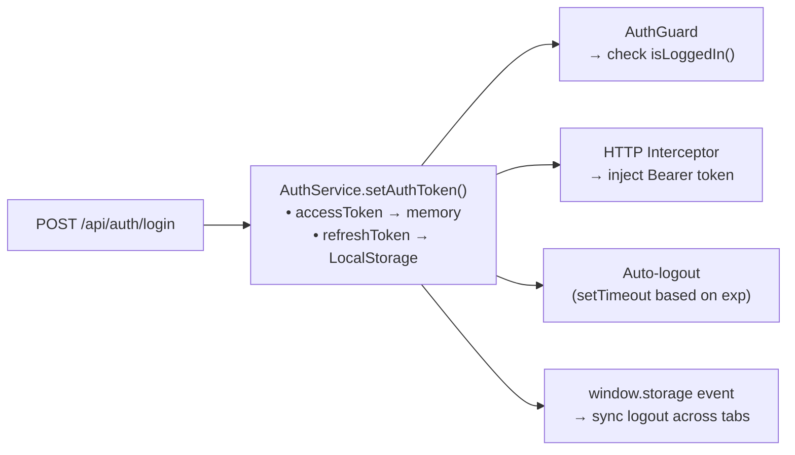
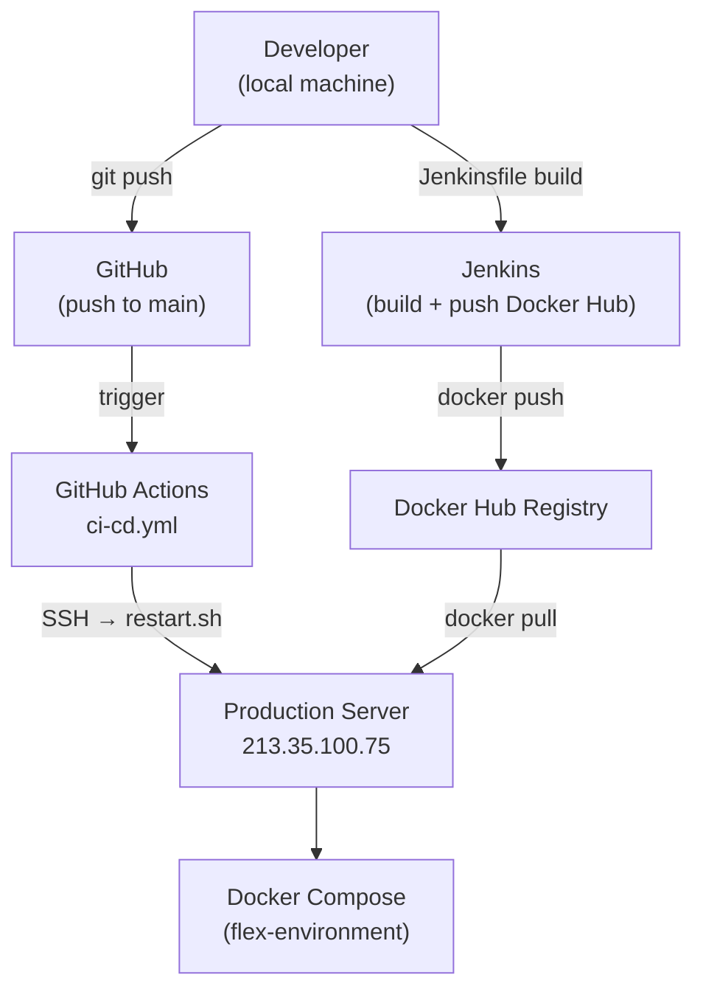

# Tài liệu kiến trúc hệ thống: Flex Platform

## 1. Executive Summary

Flex Platform là hệ thống web application nhiều lớp gồm một Angular frontend, một API Gateway trung gian, một Auth Service cấp JWT, và lớp infrastructure Docker Compose cho data, messaging, và observability.

| Hạng mục | Thông tin |
| --- | --- |
| Scope | Toàn workspace — 4 repo nghiệp vụ + infrastructure |
| Primary users | End user qua Angular SPA; developer, DevOps |
| Architecture style | Microservice gateway pattern — `Inferred` (riêng repo, YARP gateway, RabbitMQ messaging) |
| Frontend | Angular 16 (TypeScript 5.1, Bootstrap 5) |
| Backend | ASP.NET Core 9 (.NET 9, C# 13) |
| Database (identity) | Oracle Enterprise (EF Core 9, Oracle Wallet auth) |
| Database (infra) | Azure SQL Edge (docker-compose) — `Unknown` xem section 8 |
| Cache | Redis 7-alpine |
| Queue/Event | RabbitMQ 4.1.3 (topic exchange, quorum queues, DLX) |
| Object storage | MinIO (S3-compatible) |
| Search / Analytics | Elasticsearch 8.13.4 + Kibana |
| AI inference | Ollama (qwen2.5:0.5b) via flex-ai-gateway |
| Deployment | Docker Compose (local/dev), GitHub Actions → SSH deploy (prod) |
| CI/CD | Jenkins (CasC) + GitHub Actions |
| Observability | Serilog → Logstash → Elasticsearch, correlation ID, ECS schema |

---

## 2. Mục đích và phạm vi

### Mục đích nghiệp vụ

- Cung cấp nền tảng web có xác thực, phân quyền, quản lý user và nhiều tính năng nghiệp vụ (branch management, dashboard, v.v.)
- Tích hợp AI inference nội bộ qua Ollama

### Phạm vi tài liệu

Bao gồm:
- Kiến trúc 4 repo: `flex-api-gateway`, `flex-auth-service`, `flex-microfrontend`, `flex-environment`
- Infrastructure Docker Compose: tất cả service được định nghĩa
- Workspace tooling: `flex-workstation` (điều phối, không chứa code nghiệp vụ)

Không bao gồm:
- Chi tiết nghiệp vụ của từng tính năng (xem `docs/` trong từng repo)
- Kiến trúc Oracle Database schema chi tiết
- Triển khai production đầy đủ (chỉ partial)

### Audience

Developer, DevOps, Security reviewer, Tech lead / Architect

---

## 3. Evidence Summary

| Claim | Confidence | Evidence |
| --- | --- | --- |
| API Gateway dùng YARP 2.3.0 | Confirmed | `flex-api-gateway/src/Flex.Apigateway/Flex.Apigateway.csproj` |
| Auth service dùng Oracle + EF Core | Confirmed | `flex-auth-service/src/Flex.Infrastructures/Persistence/IdentityDbContext.cs` |
| JWT dùng HS256, secret key 44 chars | Confirmed | `flex-auth-service/src/Flex.Infrastructures/Authentication/TokenService.cs`, `appsettings.json` |
| Frontend là Angular 16 | Confirmed | `flex-microfrontend/package.json`, `angular.json` |
| Không phải true microfrontend (không có Module Federation) | Confirmed | Single Angular app với lazy-loaded routes, không có remote entry points |
| RabbitMQ dùng Transactional Outbox từ auth-service | Confirmed | `flex-auth-service/src/Flex.Infrastructures/Messaging/Outbox/OutboxProcessor.cs` |
| Production server tại 213.35.100.75 | Confirmed | `flex-environment/README.md`, `.github/workflows/ci-cd.yml` |
| Credentials nhạy cảm hardcode trong `appsettings.json` | Confirmed | `flex-auth-service/src/Flex.Auth/appsettings.json` (Oracle password, JWT secret, RabbitMQ password) |
| branch-service tồn tại như downstream service | Inferred | `flex-api-gateway/yarp.Development.json` (route `/api/branches` → `branch-service:http://localhost:5001`) |
| SQL Server trong infra nhưng auth-service dùng Oracle | Confirmed | `flex-environment/docker-compose.yml` (sqlserverdb), `flex-auth-service/appsettings.json` (OracleWallet) |
| Angular app chưa đổi tên từ template "skote" | Confirmed | `flex-microfrontend/angular.json` (projectName: "skote") |

---

## 4. System Context



---

## 5. Kiến trúc tổng quan

### Architecture Style

Phân loại hiện tại: **Microservice gateway pattern** — `Inferred`

Lý do:
- `Confirmed`: Mỗi service có repo riêng, Dockerfile riêng, pipeline Jenkins riêng
- `Confirmed`: YARP gateway tập trung xử lý JWT validation, rate limiting, resilience trước khi forward
- `Confirmed`: Auth-service độc lập, phát event qua RabbitMQ (Transactional Outbox)
- `Inferred`: `branch-service` tham chiếu trong YARP config nhưng không có trong workspace hiện tại
- `Unknown`: Có bao nhiêu downstream service khác ngoài auth và branch?

### Component View



### Component Inventory

| Component | Trách nhiệm | Công nghệ | Evidence |
| --- | --- | --- | --- |
| flex-microfrontend | SPA Angular, UI toàn bộ tính năng | Angular 16, Bootstrap 5, RxJS | `flex-microfrontend/angular.json` |
| flex-api-gateway | Entrypoint HTTP, JWT validate, rate limit, route | .NET 9, YARP 2.3.0, Polly 8 | `flex-api-gateway/src/Flex.Apigateway/` |
| flex-auth-service | Identity, JWT issuance, user CRUD | .NET 9, EF Core 9, Oracle | `flex-auth-service/src/Flex.Auth/` |
| flex-environment | Docker Compose infra stack | Docker, RabbitMQ, Redis, ES, MinIO, Jenkins, Ollama | `flex-environment/docker-compose*.yml` |
| flex-workstation | Workspace coordination, docs, skills, bootstrap | PowerShell, Markdown | `flex-workstation/` |
| Flex.Infrastructures (gateway) | Shared middleware library | ASP.NET Core middleware | `flex-api-gateway/src/Flex.Infrastructures/` |
| Flex.Infrastructures (auth) | Shared infra: auth, messaging, logging | ASP.NET Core, Serilog, Polly | `flex-auth-service/src/Flex.Infrastructures/` |
| flex-ai-gateway | AI inference proxy (Ollama) | Custom (v1.0.4-dev) | `flex-environment/docker-compose.yml`, `mounts/flex-ai-gateway/.env` |

---

## 6. Codebase Structure

```text
C:\Workspace\Project\
├── .claude/                    # Claude Code runtime config (bootstrapped từ flex-workstation)
├── .agents/                    # Codex runtime config (bootstrapped từ flex-workstation)
├── flex-api-gateway/           # API Gateway service
│   ├── src/
│   │   ├── Flex.Apigateway/    # Web host: Program.cs, Controllers, Extensions
│   │   └── Flex.Infrastructures/ # Shared middleware: Auth, Logging, Resilience, YARP
│   ├── docs/                   # Logging architecture docs (13 files)
│   ├── Dockerfile
│   └── Jenkinsfile
├── flex-auth-service/          # Authentication service
│   ├── src/
│   │   ├── Flex.Auth/          # Web host: Controllers, Services, Repositories
│   │   ├── Flex.Domain/        # Entities, Domain Events, Abstractions
│   │   └── Flex.Infrastructures/ # Persistence, Messaging, Auth, Logging
│   ├── docs/                   # Auth docs (15+ files)
│   ├── secrets/oracle-wallet/
│   ├── Dockerfile
│   └── Jenkinsfile
├── flex-microfrontend/         # Angular SPA
│   ├── src/
│   │   ├── app/
│   │   │   ├── account/        # Login, signup, password reset
│   │   │   ├── core/           # AuthService, Guards, Interceptors, Models
│   │   │   ├── pages/          # Feature modules (lazy-loaded): branch, dashboard, v.v.
│   │   │   ├── layouts/        # Sidebar, topbar, footer
│   │   │   └── shared/         # Shared UI components
│   │   └── environments/
│   └── angular.json
├── flex-environment/           # Infrastructure Docker Compose
│   ├── docker-compose*.yml
│   ├── mounts/                 # Service mount configs (RabbitMQ, Jenkins, Kibana, Ollama)
│   ├── restart.sh              # Deploy script (prod)
│   └── .github/workflows/ci-cd.yml
├── flex-workstation/           # Workspace coordinator
│   ├── docs/                   # Architecture, onboarding, projects, tasks
│   ├── templates/project-root/ # Scaffold templates
│   ├── skills/                 # Shared AI skills (source)
│   ├── scripts/                # Bootstrap, sync, hook scripts
│   └── config/workspace-assistants.json
├── CLAUDE.md                   # Root Claude Code instructions
└── AGENTS.md                   # Root Codex instructions
```

---

## 7. Runtime Flows

### 7.1 Login Flow



### 7.2 Authenticated Request Flow



### 7.3 Frontend Auth State Management



---

## 8. Data Architecture

| Data Store / Entity | Mục đích | Owner | Consistency / Retention | Evidence |
| --- | --- | --- | --- | --- |
| Oracle DB (Users, Roles, Permissions) | Identity persistence | flex-auth-service | Strong (EF Core transactions) | `flex-auth-service/src/Flex.Infrastructures/Persistence/IdentityDbContext.cs` |
| Oracle DB (LoginHistory) | Audit trail đăng nhập | flex-auth-service | Append-only, retention: Unknown | `flex-auth-service/src/Flex.Domain/Entities/LoginHistory.cs` |
| Oracle DB (OutboxMessage) | Transactional outbox buffer | flex-auth-service | At-least-once, consumed by background job | `flex-auth-service/src/Flex.Infrastructures/Messaging/Outbox/` |
| RabbitMQ (q.audit.user-login) | Audit event stream | flex-auth-service → consumers | Quorum queue, 2-week DLQ TTL | `flex-environment/mounts/rabbitmq/definitions.json` |
| Redis 7 | Cache / session (purpose Unknown) | Unknown | Unknown | `flex-environment/docker-compose.yml` |
| Azure SQL Edge (sqlserverdb) | Database cho service khác (không phải auth) | Unknown | Unknown — không thấy EF migration | `flex-environment/docker-compose.yml` |
| Elasticsearch 8.13.4 | Log aggregation + search | Infra | Unknown retention | `flex-environment/docker-compose.yml` |
| MinIO | Object storage | Unknown | Unknown | `flex-environment/docker-compose.yml` |
| Oracle DB (flex-ai-gateway) | Oracle data cho AI service | flex-ai-gateway | Unknown | `flex-environment/mounts/flex-ai-gateway/.env` |

**Unknowns:**

- Mục đích của Redis và Azure SQL Server trong Docker Compose chưa rõ — không thấy service nào dùng trong workspace hiện tại
- Retention policy cho Elasticsearch, Redis, MinIO chưa được document
- EF Core migration strategy chưa xác định (không tìm thấy migrations folder)

---

## 9. API và Integration

### Confirmed endpoints

| Method | Endpoint | Consumer | Provider | Auth | Notes |
| --- | --- | --- | --- | --- | --- |
| POST | `/api/auth/login` | Angular, YARP | flex-auth-service | None (AllowAnonymous) | Trả `{ accessToken }` |
| GET | `/api/users` | Angular (Inferred) | flex-auth-service | JWT Bearer | Confirmed controller |
| POST | `/api/users/create` | Angular (Inferred) | flex-auth-service | JWT Bearer | Confirmed controller |
| GET | `/` | Monitoring | flex-api-gateway | None | Health check, trả version + time |
| ANY | `/api/branches/**` | Angular | branch-service (Inferred) | JWT Bearer | Defined in `yarp.Development.json` |

### Chưa implement (per SPEC.md)

| Endpoint | Status |
| --- | --- |
| `POST /api/auth/logout` | Commented out — token revocation chưa có |
| `GET /api/auth/me` | Commented out |
| Refresh token endpoint | Chưa implement |

### Integration risks

- `branch-service` được khai báo trong YARP config nhưng không có trong workspace — có thể service nằm ở repo riêng chưa được thêm vào workspace
- flex-ai-gateway (v1.0.4-dev) tích hợp Oracle — không rõ API surface và consumer

---

## 10. Security Architecture

| Area | Current state | Risk | Evidence |
| --- | --- | --- | --- |
| Authentication | JWT Bearer HS256, validate issuer + audience + lifetime + signature | Medium — HMAC shared key, không phải asymmetric | `flex-auth-service/src/Flex.Infrastructures/Authentication/TokenService.cs` |
| Authorization | Role-based policies (RequireAdminRole, RequireAuthenticatedUser, v.v.) | Low | `flex-api-gateway/src/Flex.Infrastructures/Authentication/AuthorizationPolicies.cs` |
| Secrets management | **Credentials hardcode trong appsettings.json** (Oracle password, JWT secret key, RabbitMQ password) | **High** | `flex-auth-service/src/Flex.Auth/appsettings.json` — confirmed |
| JWT secret key | Key 44 chars (đủ cho HS256), cùng key ở cả gateway lẫn auth service | High — một key bị lộ compromise toàn bộ | `flex-api-gateway/.env.example`, `flex-auth-service/.env.example` |
| CORS | `AllowAnyOrigin() + AllowAnyMethod() + AllowAnyHeader()` | Medium — không restrict origin | `flex-api-gateway/src/Flex.Apigateway/Extensions/ServiceExtensions.cs` (Inferred từ doc) |
| Token features | Logout/revocation chưa implement, refresh token chưa có | Medium — token không thể bị thu hồi | `flex-auth-service/src/Flex.Auth/Controllers/AuthController.cs` (commented out) |
| RBAC enforcement | Permission entity tồn tại nhưng chưa được enforce trong bất kỳ middleware nào | Medium | `flex-auth-service/src/Flex.Domain/Entities/Permission.cs` |
| Sensitive data logging | Authorization, Cookie, X-Api-Key headers bị loại khỏi log | Low (good) | `flex-api-gateway/src/Flex.Apigateway/appsettings.json` |
| Token storage (frontend) | refreshToken lưu vào LocalStorage (XSS risk) | Medium | `flex-microfrontend/src/app/core/services/auth.service.ts` |
| Tenant isolation | Unknown — không thấy cơ chế multi-tenant | Unknown | — |

---

## 11. Deployment Architecture



### Môi trường

| Environment | Runtime | Config source | Notes |
| --- | --- | --- | --- |
| Local (dev) | Angular CLI (`ng serve :4200`) + .NET (`dotnet run`) | `appsettings.Development.json`, `environment.ts` | Oracle Wallet path hardcode local machine |
| Docker (dev) | Docker Compose (flex-environment) | `docker-compose.override.yml`, `.env` mounts | Full infra stack |
| Production | VPS 213.35.100.75, Docker Compose | `docker-compose.yml` (no override), ENV vars | Deploy qua GitHub Actions → SSH → `restart.sh` |

### Ports (Docker Compose dev)

| Service | Port |
| --- | --- |
| Redis | 6379 |
| SQL Server | 1433 |
| RabbitMQ | 5672 (AMQP), 15672 (Management UI) |
| Elasticsearch | 9200 |
| Kibana | 5601 |
| MinIO | 9002 (API), 9001 (Console) |
| Jenkins | 8080 |
| Portainer | 9000, 9443 |
| RedisInsight | 5540 |
| flex-ai-gateway | 5005 |
| Ollama | 11434 |

---

## 12. Observability

| Area | Current state | Gap / Recommendation | Evidence |
| --- | --- | --- | --- |
| Logging | Serilog + ECS schema → Console/File/Logstash → Elasticsearch | Retention policy chưa xác định | `flex-api-gateway/src/Flex.Infrastructures/Logging/SeriLogger.cs` |
| Distributed tracing | CorrelationId middleware (X-Correlation-Id) propagated qua tất cả request và downstream | Không phải OpenTelemetry đầy đủ — không có trace span hierarchy | `flex-api-gateway/src/Flex.Infrastructures/Observability/CorrelationIdMiddleware.cs` |
| Metrics | Unknown — không thấy Prometheus/metrics endpoint | Gap: không có metrics scraping | — |
| Health checks | GET `/` tại gateway trả status + version | Không có `/health` hay `/ready` endpoint chuẩn | `flex-api-gateway/src/Flex.Apigateway/Extensions/ApplicationExtensions.cs` |
| Alerts / dashboards | Kibana dashboard export có (`flex-environment/mounts/kibana/export.ndjson`) | Unknown nội dung dashboard — cần verify | `flex-environment/mounts/kibana/export.ndjson` |
| Request body logging | Disabled production, enabled dev (max 50KB dev, 10KB prod cap) | Sensitive body data có thể bị log trong dev | `flex-api-gateway/src/Flex.Apigateway/appsettings.Development.json` |

---

## 13. Non-functional Requirements

| Requirement | Target | Current evidence | Gap |
| --- | --- | --- | --- |
| Performance | Unknown | Rate limit: 100 req/s per identity; Circuit breaker: 50% failure threshold | Không có load test / benchmark document |
| Availability | Unknown | Polly retry (1 attempt, 200ms), circuit breaker (20s break), health check passive YARP | Không có SLA document |
| Scalability | Unknown | Stateless gateway + auth service (horizontally scalable) | RabbitMQ quorum queue (HA sẵn có) |
| Maintainability | N/A | Clean Architecture (auth-service), tách infra library, ADR docs (gateway logging) | Test coverage: 0 — không có unit/integration test |
| Security | N/A | JWT validation, rate limiting, sensitive header exclusion | Credentials in code, CORS open, no token revocation |

---

## 14. Rủi ro và Technical Debt

| Priority | Rủi ro | Impact | Khuyến nghị |
| --- | --- | --- | --- |
| **High** | Credentials hardcode trong `appsettings.json` (Oracle password, JWT secret, RabbitMQ password) | Lộ secret nếu repo bị public hoặc access log | Chuyển sang environment variables hoặc secret manager (Azure Key Vault, HashiCorp Vault) trước khi merge vào main |
| **High** | JWT secret key dùng chung HS256 giữa gateway và auth service | Một bên lộ key → toàn bộ JWT bị compromise | Cân nhắc chuyển sang RS256 (asymmetric): auth service giữ private key, gateway chỉ cần public key |
| **High** | Không có token revocation (logout/refresh token chưa implement) | Token bị steal không thể thu hồi trong 60 phút | Implement logout + token blacklist (Redis) hoặc refresh token rotation |
| **Medium** | refreshToken lưu vào LocalStorage | XSS attack có thể đánh cắp refresh token | Cân nhắc httpOnly cookie cho refresh token |
| **Medium** | CORS `AllowAnyOrigin` tại gateway | Bất kỳ domain nào cũng có thể gọi API | Restrict CORS origins theo environment |
| **Medium** | Test coverage = 0 | Regression không được phát hiện tự động | Thêm unit test cho AuthService, TokenService; integration test cho login flow |
| **Medium** | RBAC chưa enforce (`Permission` entity tồn tại nhưng không dùng) | Authorization chỉ dựa trên role, không có fine-grained permission | Implement permission check trong authorization policies |
| **Medium** | Dockerfile của auth-service reference sai (`Flex.Apigateway.dll` thay vì `Flex.Auth.dll`) | Docker image của auth-service không chạy được | Sửa `ENTRYPOINT` trong `flex-auth-service/Dockerfile` |
| **Low** | Angular app project name vẫn là "skote" (template chưa rename) | Gây nhầm lẫn khi đọc config, build output | Đổi projectName trong `angular.json` thành "flex" hoặc tên phù hợp |
| **Low** | Azure SQL Server trong Docker Compose nhưng không có service nào dùng | Lãng phí tài nguyên, gây confusion | Xóa hoặc document rõ mục đích sử dụng |
| **Low** | flex-ai-gateway version `v1.0.4-dev` không có source trong workspace | Không thể audit/modify | Thêm source repo hoặc document dependency |

---

## 15. Recommendations

### High

- **[Security]** Chuyển toàn bộ credentials ra environment variables và `.env` files (không commit). Dùng `.env.example` chỉ chứa placeholder — hiện `appsettings.json` đang chứa real password.
- **[Security]** Implement logout + token revocation bằng Redis blacklist. Priority cao vì đây là feature cơ bản của auth service.
- **[Bug]** Fix Dockerfile trong `flex-auth-service` — entrypoint đang trỏ sang `Flex.Apigateway.dll`.

### Medium

- **[Security]** Cân nhắc RS256 cho JWT khi hệ thống scale thêm service — asymmetric key dễ distribute public key hơn.
- **[Testing]** Thêm tối thiểu unit test cho `AuthService.LoginAsync()` và `TokenService.GenerateToken()` trước khi deploy production.
- **[Auth]** Implement RBAC enforcement — `Permission` entity đã có, cần wire vào authorization policy.
- **[DevX]** Rename Angular project từ "skote" sang tên phù hợp với platform.

### Low

- **[Infra]** Document hoặc xóa `sqlserverdb` trong Docker Compose nếu không có service dùng.
- **[Observability]** Thêm `/health` và `/ready` endpoint chuẩn vào cả gateway lẫn auth service.
- **[Observability]** Cân nhắc thêm OpenTelemetry để có trace span hierarchy thay vì chỉ correlation ID.

---

## 16. Open Questions

| Câu hỏi | Owner | Impact |
| --- | --- | --- |
| `branch-service` (port 5001) là repo nào? Đã deploy chưa? | Dev team | High — YARP route đang trỏ vào đây |
| Azure SQL Server trong Docker Compose phục vụ service nào? | Dev team | Medium — gây confusion về data architecture |
| Redis được dùng để làm gì? (cache, session, hay token blacklist?) | Dev team | Medium — ảnh hưởng quyết định implement logout |
| Retention policy cho Elasticsearch logs là bao lâu? | DevOps | Medium — storage cost production |
| flex-ai-gateway source code nằm ở đâu? API surface là gì? | Dev team | Low |
| Chiến lược EF Core migration cho Oracle (auto-migrate hay script thủ công)? | Dev team | Medium — rủi ro schema drift |
| Có SLA/uptime target cho production không? | Product/DevOps | Medium — ảnh hưởng resilience config |

---

## 17. Suggested ADRs

| ADR | Quyết định | Tại sao cần ghi lại | Status |
| --- | --- | --- | --- |
| ADR-001 | Dùng YARP thay vì Nginx/Ocelot làm API Gateway | Vendor lock-in .NET ecosystem, trade-off so với giải pháp polyglot | Proposed |
| ADR-002 | JWT HS256 vs RS256 | Symmetric key dễ setup nhưng rủi ro khi có nhiều service cần validate | Proposed |
| ADR-003 | Transactional Outbox cho event publishing | Tại sao không publish trực tiếp vào RabbitMQ trong transaction | Proposed |
| ADR-004 | Oracle làm identity store (thay vì PostgreSQL/SQL Server) | Có thể là yêu cầu enterprise, cần document lý do để onboarding mới hiểu | Proposed |
| ADR-005 | Single Angular SPA vs true Microfrontend | Tên repo là "microfrontend" nhưng thực tế là monolithic Angular | Proposed |

---

## 18. Tài liệu liên quan

| Tài liệu | Mô tả | Đường dẫn |
| --- | --- | --- |
| Workspace system map | Snapshot hiện tại của workspace và bootstrap flow | `flex-workstation/docs/system-map.md` |
| Onboarding checklist | Hướng dẫn bootstrap máy mới | `flex-workstation/docs/onboarding.md` |
| Project list | Danh sách repo theo dõi | `flex-workstation/docs/projects.md` |
| Gateway logging architecture | ADR + docs chi tiết cho global logging | `flex-api-gateway/docs/GlobalLogging-Index.md` |
| Auth service technical spec | Kiến trúc auth chi tiết (1000+ dòng) | `flex-auth-service/docs/technical/auth.md` |
| Auth service spec | Feature list và trạng thái | `flex-auth-service/SPEC.md` |
| Environment setup | Hướng dẫn cài đặt dev environment | `flex-environment/INSTALL.md` |

---

*Tài liệu này được tạo ngày 2026-06-17. Cập nhật khi có thay đổi kiến trúc quan trọng.*
