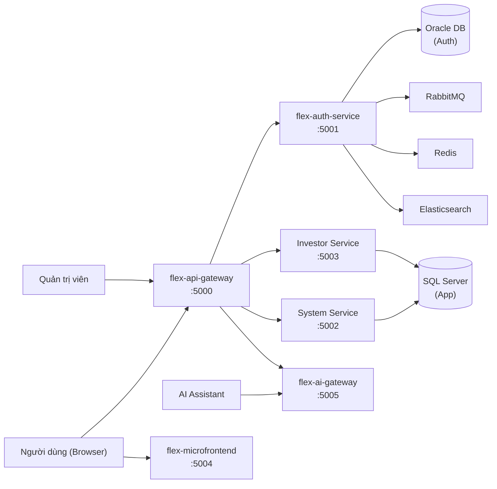
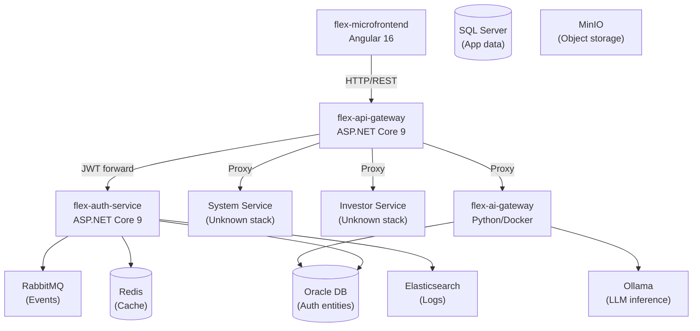
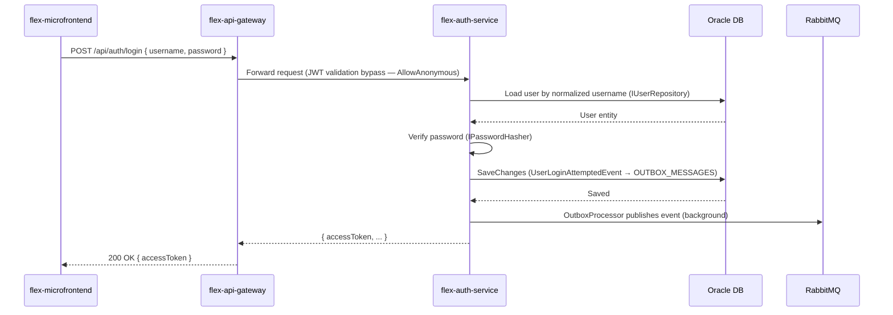
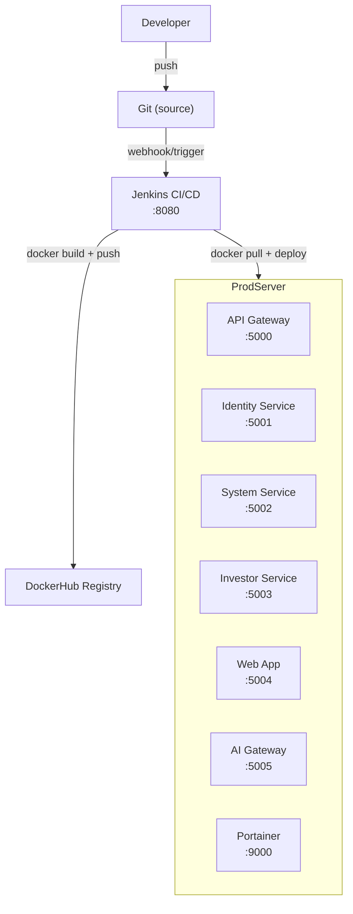

# Tài liệu kiến trúc hệ thống: Flex Platform

## 1. Executive Summary

Flex Platform là hệ thống quản lý nghiệp vụ (investor management, system management) được xây dựng theo kiến trúc microservices. Các service giao tiếp qua API Gateway, xác thực bằng JWT, và kết nối nội bộ qua RabbitMQ.

| Hạng mục | Thông tin |
| --- | --- |
| Scope | Toàn bộ workspace `C:\Workspace\Project` |
| Primary users | Nhà đầu tư, quản trị viên hệ thống, internal service-to-service |
| Architecture style | Microservices + API Gateway (Inferred) |
| Backend | .NET 9 / ASP.NET Core (auth-service, api-gateway); Unknown (system-service, investor-service) |
| Frontend | Angular 16 (flex-microfrontend) |
| Database | Oracle Database (flex-auth-service, Confirmed); SQL Server Azure SQL Edge (flex-environment, Confirmed); MySQL + PostgreSQL (production, Confirmed từ README) |
| Cache | Redis 7 (Confirmed — docker-compose.yml) |
| Queue/Event | RabbitMQ 4.1.3 (Confirmed — docker-compose.yml + Outbox/Inbox trong auth-service) |
| Object Storage | MinIO (Confirmed — docker-compose.yml) |
| AI Gateway | flex-ai-gateway + Ollama (Confirmed — docker-compose.yml) |
| Deployment | Docker Compose + Jenkins + DockerHub (Confirmed — Jenkinsfile, flex-environment) |
| Observability | Serilog + Elasticsearch + Kibana (Confirmed — auth-service config, docker-compose.yml) |

---

## 2. Purpose and Scope

### Business Purpose

- Xác thực và ủy quyền người dùng (JWT, RBAC).
- Quản lý nhà đầu tư.
- Quản lý hệ thống.
- Giao diện web cho người dùng cuối.
- AI gateway cho tính năng trợ lý trí tuệ nhân tạo.

### Documentation Scope

Included:

- Toàn bộ repo trong `C:\Workspace\Project`: flex-auth-service, flex-api-gateway, flex-microfrontend, flex-environment, flex-workstation.
- Infrastructure runtime (Docker Compose).
- CI/CD pipeline (Jenkins).
- Workspace tooling (Claude Code, Codex).

Excluded:

- System Service (port 5002) — chưa có repo local.
- Investor Service (port 5003) — chưa có repo local.
- Chi tiết nghiệp vụ từng service chưa có trong workspace.

### Audience

- Developer / Tech Lead: cần hiểu component structure, runtime flow, integration patterns.
- DevOps / Infra: cần hiểu deployment, environment, CI/CD, config management.
- Security Reviewer: cần hiểu auth flow, secret management, exposure points.
- AI Agent: navigation map để hiểu nhanh repo nào giữ vai trò gì.

---

## 3. Evidence Summary

| Claim | Confidence | Evidence |
| --- | --- | --- |
| Microservices + API Gateway pattern | Inferred | 5 service ports (5000-5004) trong flex-environment/README.md; flex-api-gateway và flex-auth-service là 2 service độc lập |
| flex-auth-service dùng Oracle DB | Confirmed | `Oracle.EntityFrameworkCore` trong bin/Debug; `OracleWallet` config section trong CLAUDE.md; `secrets/oracle-wallet` directory |
| RabbitMQ + Transactional Outbox/Inbox | Confirmed | `RabbitMQ.Client.dll`; `Flex.Infrastructures/Messaging/Outbox` và `Inbox` directories |
| JWT Bearer HMAC-SHA256 | Confirmed | `JwtSettings` section trong CLAUDE.md; `Microsoft.IdentityModel.Tokens.Jwt.dll` |
| Serilog + Elasticsearch logging | Confirmed | `Serilog.Sinks.Http.dll`, `Elastic` config section trong CLAUDE.md; Elasticsearch service trong docker-compose.yml |
| Polly resilience | Confirmed | `Polly.dll`, `Microsoft.Extensions.Http.Resilience.dll` trong bin |
| Jenkins CI/CD với Docker push | Confirmed | `flex-auth-service/Jenkinsfile`; `flex-api-gateway/Jenkinsfile` — build + push DockerHub |
| Angular 16 frontend | Confirmed | `flex-microfrontend/package.json` — `@angular/core: 16.1.4` |
| flex-api-gateway có cùng Infrastructures layer | Confirmed | `src/Flex.Infrastructures` trong cả hai repo, cùng naming conventions |
| Refresh token / logout chưa implement | Confirmed | `AuthController.cs` — logout, me đều comment out; SPEC.md liệt kê là missing features |
| Real credentials trong appsettings.json | Confirmed | CLAUDE.md flex-auth-service: "appsettings.json currently contains real credentials for Oracle, RabbitMQ, Elastic, and JWT" |
| Production server tại 213.35.100.75 | Confirmed | `flex-environment/README.md` |
| flex-ai-gateway là LLM proxy | Confirmed | `docker-compose.yml` — image `luyenhaidangit/flex-ai-gateway:1.0.4-dev`, depends_on ollama; port 5005 |
| System Service và Investor Service | Unknown | Được liệt kê trong flex-environment/README.md (ports 5002, 5003) nhưng không có repo local trong workspace |

---

## 4. System Context



---

## 5. Architecture Overview

### Architecture Style

Current classification: `Microservices + API Gateway + Event-Driven (partial)`.

Rationale:

- **Inferred**: Nhiều service độc lập (auth, system, investor, ai-gateway) giao tiếp qua API Gateway — pattern rõ ràng từ port mapping trong `flex-environment/README.md`.
- **Confirmed**: `flex-auth-service` dùng Transactional Outbox/Inbox pattern (`Flex.Infrastructures/Messaging/Outbox`, `Inbox`) — event-driven cho audit log/integration events.
- **Confirmed**: `flex-api-gateway` là service riêng với Dockerfile và Jenkinsfile, không phải reverse proxy cấu hình đơn thuần.
- **Unknown**: Cách `flex-api-gateway` route request đến các service (YARP? Ocelot? custom?) — không đọc được controller/routing config.

### Component View



| Component | Responsibility | Technology | Evidence |
| --- | --- | --- | --- |
| `flex-api-gateway` | Entry point duy nhất, routing, auth validation, rate limiting | .NET 9, ASP.NET Core | `flex-api-gateway/Flex.ApiGateway.sln`, `Dockerfile` |
| `flex-auth-service` | Xác thực, JWT issuance, user/role management | .NET 9, Oracle EF Core, Identity | `flex-auth-service/Flex.Auth.sln`, `CLAUDE.md` |
| `flex-microfrontend` | SPA frontend cho người dùng cuối | Angular 16, Bootstrap 5, TypeScript | `flex-microfrontend/package.json` |
| `flex-ai-gateway` | LLM proxy kết nối Ollama cho AI features | Docker image, Ollama backend | `docker-compose.yml` — `luyenhaidangit/flex-ai-gateway:1.0.4-dev` |
| System Service | Quản lý hệ thống | Unknown | `flex-environment/README.md` port 5002 |
| Investor Service | Quản lý nhà đầu tư | Unknown | `flex-environment/README.md` port 5003 |
| `flex-environment` | Infrastructure provisioning | Docker Compose | `flex-environment/docker-compose.yml` |
| `flex-workstation` | Workspace tooling, skills, bootstrap, docs | PowerShell, Markdown | `flex-workstation/README.md` |

---

## 6. Codebase Structure

```text
C:\Workspace\Project\
├── .claude\                    # Runtime config Claude Code (generated)
│   ├── agents\                 # Agent personas
│   ├── commands\               # Slash commands
│   ├── hooks\                  # Event hooks
│   ├── skills\                 # Runtime skills
│   ├── settings.json
│   └── settings.local.json
├── .agents\                    # Runtime config Codex (generated)
├── flex-api-gateway\           # API Gateway service
│   ├── src\
│   │   ├── Flex.Apigateway\    # Gateway controllers, extensions
│   │   └── Flex.Infrastructures\  # Shared infra (JWT, logging, resilience)
│   ├── Dockerfile
│   └── Jenkinsfile
├── flex-auth-service\          # Identity/Auth service
│   ├── src\
│   │   ├── Flex.Auth\          # API host (controllers, services, repositories)
│   │   ├── Flex.Domain\        # Entities, domain events, constants
│   │   └── Flex.Infrastructures\  # EF Core, JWT, RabbitMQ, Serilog, Polly
│   ├── secrets\oracle-wallet\  # Oracle Wallet (local, không commit secrets)
│   ├── Dockerfile
│   ├── Jenkinsfile
│   └── SPEC.md                 # Feature backlog (missing features)
├── flex-environment\           # Infrastructure provisioning
│   ├── docker-compose.yml
│   ├── docker-compose.override.yml
│   └── mounts\                 # Config files mounted vào containers
├── flex-microfrontend\         # Angular 16 SPA
│   ├── src\                    # Angular app source
│   └── package.json
└── flex-workstation\           # Workspace coordination
    ├── config\workspace-assistants.json
    ├── docs\                   # Workspace-level documentation
    │   └── architecture\       # Thư mục kiến trúc chi tiết
    │       └── overview.md     # File này
    ├── scripts\                # Bootstrap, sync, tooling scripts
    ├── skills\                 # Skill source files
    └── templates\              # Project root bootstrap templates
```

| Path / Module | Responsibility | Notes |
| --- | --- | --- |
| `flex-auth-service/src/Flex.Auth` | API host — thin controllers, services, repositories | Controllers delegate hoàn toàn cho services |
| `flex-auth-service/src/Flex.Domain` | Domain entities, events, constants, base abstractions | Không phụ thuộc infrastructure |
| `flex-auth-service/src/Flex.Infrastructures` | Cross-cutting: EF Core, JWT, RabbitMQ, Serilog, Polly, rate limiting | Shared với flex-api-gateway (cùng pattern) |
| `flex-api-gateway/src/Flex.Apigateway` | Gateway routing, middleware pipeline | Routing logic chưa được đọc chi tiết |
| `flex-api-gateway/src/Flex.Infrastructures` | Mirror của auth-service Infrastructures | Unknown: có share binary hay duplicate code? |
| `flex-environment/docker-compose.yml` | Khai báo services và volumes | Base config, override ở `.override.yml` |
| `flex-workstation/config/workspace-assistants.json` | Source-of-truth cho skills/agents/commands | Sync vào `.claude` và `.agents` khi bootstrap |

---

## 7. Runtime Flows

### Flow 1: Đăng nhập (Login)



| Step | Component | Action | Evidence |
| --- | --- | --- | --- |
| 1 | `AuthController` | Nhận POST /api/auth/login | `AuthController.cs:26-33` |
| 2 | `AuthService.LoginAsync` | Load user, verify password | `CLAUDE.md` — Login flow section |
| 3 | `IOutboxWriter` | Ghi `UserLoginAttemptedEvent` vào `OUTBOX_MESSAGES` | `CLAUDE.md` — Login flow step 4 |
| 4 | `OutboxProcessor` | Background publish sang RabbitMQ | `Flex.Infrastructures/Messaging/Outbox` directory |
| 5 | Response | `Result.Success(loginResult)` | `AuthController.cs:31` |

### Flow 2: Refresh Token / Logout / GET /me

`Assumption`: Chưa được implement. Các endpoint này đang comment out trong `AuthController.cs`. Kế hoạch implement chi tiết ở `flex-auth-service/SPEC.md`.

---

## 8. Data Architecture

| Data store / Entity | Purpose | Owner | Consistency / Retention | Evidence |
| --- | --- | --- | --- | --- |
| Oracle DB | User, Role, Permission, LoginHistory, OutboxMessage, InboxMessage | flex-auth-service | ACID — EF Core unit of work | `CLAUDE.md` — Infrastructure section |
| SQL Server (Azure SQL Edge) | App data (Unknown entities) | System Service, Investor Service | Unknown | `docker-compose.yml` — sqlserverdb service |
| MySQL (production) | Product database | Unknown service | Unknown | `flex-environment/README.md` |
| PostgreSQL (production) | Customer database | Unknown service | Unknown | `flex-environment/README.md` |
| Redis | Cache (Unknown keys/TTL) | Unknown — kết nối trong docker-compose | Unknown | `docker-compose.yml` |
| RabbitMQ | Integration events (audit, domain events) | flex-auth-service (publisher) | At-least-once via Outbox | `Jenkinsfile`, `docker-compose.yml` |
| Elasticsearch | Structured logs (Serilog sink) | All services | Retention Unknown | `docker-compose.yml` — elasticsearch service |
| MinIO | Object storage (Unknown use case) | Unknown | Unknown | `docker-compose.yml` |
| `REVOKED_TOKENS` (Oracle) | Token blacklist (JWT jti) | flex-auth-service | TTL cleanup planned via background job | `SPEC.md` — Feature 2 |
| `REFRESH_TOKENS` (Oracle) | Refresh token rotation | flex-auth-service | 7-day TTL (planned) | `SPEC.md` — Feature 1 |

Unknowns:

- Schema chi tiết của Oracle DB chưa được đọc (migrations/entity configurations chưa inspect).
- Không rõ Redis được dùng cho mục đích gì (session cache, rate limit counter, hay application cache).
- Không rõ MySQL và PostgreSQL của production được dùng bởi service nào (System hay Investor).
- Không rõ MinIO được dùng cho file/attachment gì.

---

## 9. API và Integration

### Endpoints đã implement (Confirmed)

| Method | Endpoint | Service | Auth | Notes |
| --- | --- | --- | --- | --- |
| POST | `/api/auth/login` | flex-auth-service | AllowAnonymous | Trả JWT access token |
| GET | `/health` | flex-auth-service, flex-api-gateway | Public | Health check endpoints (production: ports 5001, 5000) |

### Endpoints đã thiết kế (Planned — SPEC.md)

| Method | Endpoint | Service | Auth | Notes |
| --- | --- | --- | --- | --- |
| POST | `/api/auth/refresh-token` | flex-auth-service | AllowAnonymous | Token rotation |
| POST | `/api/auth/logout` | flex-auth-service | Authorize | Blacklist JTI |
| GET | `/api/auth/me` | flex-auth-service | Authorize | User info từ ClaimsPrincipal |
| GET/POST | `/api/users/*` | flex-auth-service | Authorize | User management (UsersController) |

### Integration Events (RabbitMQ)

| Event | Publisher | Consumer | Pattern | Evidence |
| --- | --- | --- | --- | --- |
| `UserLoginAttemptedEvent` | flex-auth-service | Unknown | Transactional Outbox → RabbitMQ | `CLAUDE.md` — Login flow step 4 |
| `UserLoggedOutEvent` | flex-auth-service (planned) | Unknown | Outbox | `SPEC.md` — Feature 2 |

Integration risks:

- Consumer của các integration events chưa xác định — có thể không ai consume.
- Không rõ flex-api-gateway forward request sang auth-service bằng cách nào (HTTP reverse proxy hay gRPC).

---

## 10. Security Architecture

| Area | Current state | Risk | Evidence |
| --- | --- | --- | --- |
| Authentication | JWT Bearer HMAC-SHA256, `AllowAnonymous` cho login | Medium — thiếu refresh/revoke | `CLAUDE.md` — Authentication section; `AuthController.cs` |
| Authorization | `[Authorize]` cơ bản; RBAC chưa enforce thực sự | High — Permission entity có nhưng không dùng | `SPEC.md` — Feature 5 RBAC |
| JWT Revocation | Chưa implement — không có token blacklist | High — logout không invalidate token | `AuthController.cs` — logout bị comment out; `SPEC.md` Feature 2 |
| Secrets management | **Real credentials trong `appsettings.json`** (Oracle, RabbitMQ, Elastic, JWT key) | **High** | `CLAUDE.md`: "appsettings.json currently contains real credentials" |
| Docker secrets | Passwords hardcoded trong `docker-compose.override.yml` (Redis, RabbitMQ, MinIO, Elasticsearch) | **High** | `flex-environment/docker-compose.override.yml:22,89,97,116` |
| Oracle Wallet | `secrets/oracle-wallet` — local only, không commit | Low (local) | `CLAUDE.md` — secrets note |
| JWT Secret | `.env.example` — placeholder only | Low | `flex-auth-service/.env.example` |
| SQL Injection | EF Core LINQ + `FromSqlInterpolated` policy | Low | `CLAUDE.md` — SQL Safety section |
| CSRF | Jenkins CSRF disabled: `-Dhudson.security.csrf.GlobalCrumbIssuerConfiguration.DISABLE_CSRF_PROTECTION=true` | Medium | `docker-compose.override.yml:53` |
| Tenant isolation | Unknown — không tìm thấy multi-tenant logic | Unknown | — |

---

## 11. Deployment Architecture



| Environment | Runtime | Config source | Notes |
| --- | --- | --- | --- |
| Local | .NET run, docker-compose | `appsettings.Development.json`, `.env` | Oracle Wallet local; secrets in appsettings (HIGH RISK) |
| CI (Jenkins) | Docker build | Jenkinsfile params (MAJOR, MINOR, TARGET_ENV) | Credentials từ Jenkins credentials store (`dockerhub-creds`) |
| Production | Docker containers, `flex_net` network | `docker-compose.override.yml`, `mounts/` | Server 213.35.100.75; Docker Compose orchestration |

---

## 12. Observability

| Area | Current state | Gap / Recommendation | Evidence |
| --- | --- | --- | --- |
| Logging | Serilog structured logging; ECS format; Elasticsearch/OpenSearch sink (optional); correlation ID qua `X-Correlation-Id` | Retention policy chưa rõ; request body logging cần kiểm soát | `CLAUDE.md` — Logging section; `Flex.Infrastructures/Observability` |
| Metrics | Unknown — không tìm thấy Prometheus/metrics exporter | Cần thêm metrics endpoint nếu cần alerting | — |
| Tracing | Correlation ID propagation (`GlobalLoggingMiddleware`) | Không có distributed tracing (OpenTelemetry, Jaeger) | `CLAUDE.md` — Observability section |
| Health checks | `/health` endpoints confirmed trên production (ports 5000-5003) | Chưa biết health check detail (liveness/readiness?) | `flex-environment/README.md` |
| Alerts / dashboards | Kibana (port 5601) — cấu hình Elasticsearch + Kibana | Không rõ có dashboard/alert đã cấu hình chưa | `docker-compose.override.yml:131` |

---

## 13. Non-functional Requirements

| Requirement | Target | Current evidence | Gap |
| --- | --- | --- | --- |
| Performance | Unknown | Polly timeout/circuit breaker; rate limiting ASP.NET Core; Redis cache available | Không có benchmark target |
| Availability | Unknown | `restart: unless-stopped` cho mọi container | Không có load balancer, single-node deployment |
| Scalability | Unknown | Docker Compose single-host | Không có Kubernetes/orchestration |
| Maintainability | Medium | Clean layered architecture (Domain/App/Infra); Serilog structured logs; CLAUDE.md docs | Test coverage hiện tại = 0 (test stage empty trong Jenkinsfile) |
| Security | Unknown | JWT Bearer; RBAC planned; Polly resilience | Token revocation missing; credentials in appsettings |

---

## 14. Risks và Technical Debt

| Priority | Risk | Impact | Recommendation |
| --- | --- | --- | --- |
| **High** | Real credentials trong `appsettings.json` (Oracle, RabbitMQ, Elastic, JWT) | Lộ secret nếu repo bị expose hoặc log được dump | Chuyển sang env vars hoặc secret manager; xóa giá trị thật khỏi file |
| **High** | Passwords hardcoded trong `docker-compose.override.yml` | Lộ secret nếu file được commit/share | Dùng Docker secrets hoặc `.env` file không commit |
| **High** | JWT revocation chưa implement — logout không invalidate token | Người dùng logout vẫn dùng token cũ được | Implement blacklist (REVOKED_TOKENS) theo SPEC.md Feature 2 |
| **High** | RBAC không enforce — `[Authorize]` chung chung | Mọi authenticated user truy cập được endpoint cần quyền | Implement SPEC.md Feature 5 |
| **High** | Test coverage = 0 (Jenkinsfile Test stage empty) | Regression không được phát hiện | Thêm unit + integration test theo SPEC.md Feature 6 |
| **Medium** | Refresh token chưa implement | Người dùng phải login lại khi access token hết hạn | Implement SPEC.md Feature 1 |
| **Medium** | System Service và Investor Service không có trong workspace | Không biết dependency, API contract, schema | Clone và document các repo còn thiếu |
| **Medium** | `flex-api-gateway` có bản sao `Flex.Infrastructures` — unknown nếu shared hay duplicate | Code drift giữa hai service | Xác nhận có share binary hay duplicate; cân nhắc NuGet package dùng chung |
| **Medium** | Jenkins CSRF protection bị disable | Tăng attack surface Jenkins UI | Enable CSRF protection trong Jenkins config |
| **Medium** | Single-node deployment (Docker Compose) | Không có HA, single point of failure | Cân nhắc Kubernetes nếu cần production-grade HA |
| **Low** | `flex-microfrontend` package.json tên `skote-angular-vertical` | Tên không match tên repo, gợi ý đây là template/theme | Cập nhật tên package nếu cần branding chính xác |
| **Low** | `--dangerously-skip-permissions` trong `OPEN_CLAUDE.cmd` | Cho phép Claude thực thi lệnh không cần xác nhận | Chỉ dùng trong môi trường tin cậy; document rõ trong onboarding |

---

## 15. Recommendations

### High

- **Secrets migration**: Ngay lập tức xóa credentials khỏi `appsettings.json` và `docker-compose.override.yml`. Dùng environment variables inject lúc deploy hoặc Docker secrets. Xem `flex-auth-service/.env.example` làm mẫu.
- **Token revocation**: Implement logout + blacklist theo SPEC.md Feature 2 để đảm bảo security baseline.
- **Test pipeline**: Điền nội dung thật cho stage Test trong Jenkinsfile — ít nhất `dotnet test` cho flex-auth-service.
- **RBAC enforcement**: Implement PermissionHandler theo SPEC.md Feature 5 trước khi go-live với production workload.

### Medium

- **Workspace documentation**: Clone system-service và investor-service repo vào workspace, cập nhật `docs/projects.md` và tài liệu này.
- **Shared Infrastructures**: Xác nhận flex-api-gateway dùng chung binary `Flex.Infrastructures` với flex-auth-service hay duplicate code — nếu duplicate thì đóng gói thành NuGet package nội bộ.
- **Distributed tracing**: Thêm OpenTelemetry để có trace ID xuyên service, không chỉ correlation ID trong từng service.
- **Jenkins CSRF**: Enable CSRF protection (`-Dhudson.security.csrf.GlobalCrumbIssuerConfiguration.DISABLE_CSRF_PROTECTION=false`).

### Low

- **ADR cho tech stack**: Ghi lại ADR cho Oracle vs SQL Server, lý do không dùng Redis cho token blacklist.
- **Refresh token lifetime**: Confirm 7 ngày hay configurable — ghi vào `JwtSettings` với default rõ ràng.
- **Health check detail**: Cấu hình liveness/readiness probe rõ ràng thay vì chỉ có `/health`.

---

## 16. Open Questions

| Question | Owner | Impact |
| --- | --- | --- |
| flex-api-gateway routing: YARP, Ocelot, hay custom controllers? | Backend dev | High — ảnh hưởng cách thêm route mới |
| System Service và Investor Service dùng stack gì? DB nào (MySQL hay PostgreSQL)? | Backend dev | High — cần để document đầy đủ và hiểu integration contract |
| Redis được dùng cho mục đích gì trong platform? | Backend dev | Medium — ảnh hưởng caching strategy |
| `Flex.Infrastructures` trong api-gateway: shared binary hay duplicate source? | Backend dev | Medium — maintainability |
| Retention policy cho Elasticsearch logs? | DevOps | Medium — disk usage và compliance |
| Có ADR hoặc quyết định kỹ thuật nào chưa được ghi lại không? | Tech Lead | Medium |
| Refresh token lifetime: 7 ngày hay configurable từ `JwtSettings`? | Backend dev | Low |

---

## 17. Suggested ADRs

| ADR | Decision | Why it matters | Status |
| --- | --- | --- | --- |
| ADR-001 | Dùng Oracle DB cho flex-auth-service thay vì SQL Server | Cùng hệ sinh thái với production Oracle; ảnh hưởng dev setup (Oracle Wallet) | Proposed |
| ADR-002 | Không dùng Redis cho token blacklist — lưu Oracle DB | Tránh thêm Redis dependency vào auth-service; SPEC.md đã quyết định | Proposed |
| ADR-003 | Transactional Outbox/Inbox cho integration events | Đảm bảo at-least-once delivery cho audit events | Proposed |
| ADR-004 | Shared Flex.Infrastructures library pattern | Nếu flex-api-gateway copy source thay vì share binary thì cần quyết định rõ | Proposed |
| ADR-005 | Dùng JWT HMAC-SHA256 (symmetric) thay vì RS256 (asymmetric) | Ảnh hưởng khả năng verify token ở downstream service mà không cần gọi auth | Proposed |

---

## 18. Navigation cho AI Agent

Khi làm việc trong workspace này, đọc theo thứ tự:

1. **Workspace context**: `flex-workstation/docs/system-map.md` → file này (`docs/architecture/overview.md`)
2. **flex-auth-service**: `flex-auth-service/CLAUDE.md` (patterns, naming, config) → `flex-auth-service/SPEC.md` (missing features)
3. **flex-api-gateway**: `flex-api-gateway/CHANGELOG.md` nếu có, sau đó `src/Flex.Apigateway/Controllers`
4. **flex-microfrontend**: `flex-microfrontend/src/app` — Angular routing, services
5. **Infrastructure**: `flex-environment/docker-compose.yml` + `.override.yml`

Source-of-truth rules:

- Skills/agents/commands: `flex-workstation/config/workspace-assistants.json` → sync vào `.claude/` và `.agents/`
- Workspace docs: `flex-workstation/docs/` (không tạo ở workspace root)
- Skill source: `flex-workstation/skills/<name>/SKILL.md`

---

*Tài liệu được tạo: 2026-06-17. Evidence chủ yếu từ: `flex-auth-service/CLAUDE.md`, `flex-auth-service/SPEC.md`, `flex-environment/docker-compose.yml`, `flex-environment/README.md`, `flex-workstation/docs/`, `flex-api-gateway/Jenkinsfile`, `flex-microfrontend/package.json`.*
