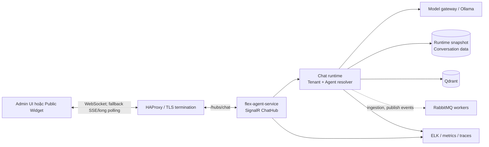
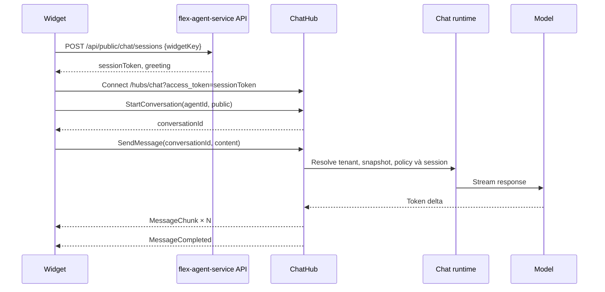

# Kiến trúc realtime

Tài liệu này mô tả kiến trúc realtime chuẩn cho Flex Agent Platform: chat streaming giữa client và `flex-agent-service`. Đây là phần bổ sung cho [Bản đồ hệ thống](./system-map.md) và cụ thể hóa các quyết định của `specs/000008-agent-platform-mvp`.

## 1. Mục tiêu và phạm vi

Realtime phục vụ hai luồng có cùng đặc tính kỹ thuật nhưng khác quyền truy cập:

| Luồng | Client | Xác thực | Nguồn dữ liệu chạy | Trạng thái |
| --- | --- | --- | --- | --- |
| Test chat | Admin UI trong `flex-microfrontend` | JWT có role tối thiểu `editor` | Agent draft và tri thức `ready` | Thiết kế đã chốt |
| Public widget | JavaScript widget nhúng trên website tenant | Session token ngắn hạn đổi từ widget key | Runtime snapshot tại `active_version` | Thiết kế đã chốt |

Mục tiêu chính là phát từng phần câu trả lời của model ngay khi có, giữ cách ly tenant, hỗ trợ reconnect và cung cấp đủ dữ liệu để vận hành. Kiến trúc này không áp dụng cho luồng khớp lệnh của `000011-exchange-api-events`; spec đó hiện loại realtime push khỏi MVP.

## 2. Quyết định kiến trúc

| Quyết định | Lựa chọn | Lý do |
| --- | --- | --- |
| Giao thức ứng dụng | SignalR Hub tại `/hubs/chat` | Một cơ chế cho cả admin và widget; .NET hỗ trợ native và tự fallback transport. |
| Transport ưu tiên | WebSocket | Độ trễ thấp, kết nối hai chiều và phù hợp token streaming. |
| Fallback | Server-Sent Events, sau đó long polling do SignalR thương lượng | Duy trì khả năng hoạt động sau proxy/firewall hạn chế WebSocket. |
| Streaming | Event `MessageChunk` theo từng delta, kết thúc bằng `MessageCompleted` hoặc `MessageFailed` | Client hiển thị sớm, vẫn có tín hiệu kết thúc rõ ràng. |
| Xử lý tác vụ dài | RabbitMQ và hosted worker | Không giữ Hub connection cho ingestion/OCR/embedding hay đồng bộ kênh. |
| Trạng thái bền vững | Database nghiệp vụ; Redis chỉ bổ sung khi cần scale-out | Hub connection và cache không phải source of truth. |

SignalR là quyết định đã được ghi trong `000008-agent-platform-mvp`; Redis backplane, multi-instance và chi tiết HAProxy bên dưới là kiến trúc mục tiêu, cần được xác nhận khi triển khai production. Hiện `flex-environment` chưa có Redis trong compose active.

## 3. Topology

`flex-agent-service` là điểm cuối duy nhất sở hữu Hub và xác thực quyền realtime. Gateway/proxy chỉ route lưu lượng; không được tự suy ra tenant, agent hay quyền của client.

## 4. Luồng kết nối và chat

### 4.1 Public widget

### 4.2 Test chat

Admin UI kết nối Hub bằng JWT, gọi `StartConversation` với `mode=test`, rồi gửi `SendMessage`. Server xác định tenant và quyền từ claim; `agentId` chỉ là khóa cần kiểm tra quyền, không phải nguồn tenant. Test chat chạy draft, ghi `is_test=true` và không tính usage.

## 5. Contract Hub

| Hướng | Tên | Payload chính | Ràng buộc |
| --- | --- | --- | --- |
| Client → server | `StartConversation` | `{ agentId, mode }` | `mode` là `test` hoặc `public`; server tự xác định principal. |
| Client → server | `SendMessage` | `{ conversationId, content }` | `content` tối đa 4.000 ký tự; conversation phải thuộc principal hiện tại. |
| Server → client | `MessageChunk` | `{ conversationId, messageId, delta }` | Có thể phát nhiều lần, theo đúng thứ tự một message. |
| Server → client | `MessageCompleted` | `{ conversationId, messageId, tokens }` | Chỉ phát một lần sau chunk cuối; mới ghi usage. |
| Server → client | `MessageFailed` | `{ conversationId, code, message }` | Các mã tối thiểu: `model_unavailable`, `timeout`, `rate_limited`. |
| Server → client | `ConversationClosed` | `{ conversationId, reason }` | Ví dụ: `agent_unpublished`, `session_expired`. |

Một message chỉ kết thúc bằng **một** trong hai event `MessageCompleted` hoặc `MessageFailed`. Client không được coi việc socket đóng là phản hồi thành công.

## 6. Bảo mật và cách ly tenant

- Tenant chỉ được resolve từ JWT claim hoặc session token đã ký/xác minh; không nhận `tenantId` từ query, payload Hub hay `agentId` do client gửi.
- Widget key chỉ dùng để đổi lấy session token có thời hạn ngắn. Không dùng widget key làm credential lâu dài trên kết nối Hub.
- Với mọi request chat, server kiểm tra conversation, agent và snapshot cùng tenant với principal.
- RAG luôn filter bắt buộc `tenant_id` và `agent_id`; mode public giới hạn tiếp theo bằng `source_ids_json` của snapshot đã phát hành.
- URL query có thể chứa `access_token` do đặc thù SignalR. Proxy, access log và telemetry phải redaction query token; tuyệt đối không log JWT/session token.
- Rate limit áp dụng trước khi gọi model, theo tenant, widget session và IP phù hợp; giới hạn concurrent stream ngăn một client chiếm toàn bộ model capacity.
- Khi agent bị gỡ phát hành hoặc session hết hạn, Hub gửi `ConversationClosed` và từ chối message tiếp theo.

## 7. Độ tin cậy, timeout và reconnect

| Tình huống | Hành vi bắt buộc |
| --- | --- |
| Mất kết nối tạm thời | SignalR tự reconnect; client dùng lại `conversationId` trong TTL session 30 phút không hoạt động. |
| Model quá 120 giây | Dừng request, phát `MessageFailed { code: timeout }`; không ghi câu trả lời dở dang. |
| Client gửi lại message sau khi không rõ kết quả | Client tra cứu lịch sử conversation trước; idempotency key cho message là hạng mục cần bổ sung nếu product cho phép retry tự động. |
| Restart service | Connection bị ngắt; client reconnect và server nạp lại trạng thái bền vững theo conversation/session. |
| Ingestion hoặc publish chậm | Xử lý qua RabbitMQ worker/outbox, không chặn Hub. |

Hub không nên giữ state nghiệp vụ chỉ trong memory. `connectionId` là dữ liệu tạm thời; `conversationId`, message và trạng thái publish phải có nơi lưu bền vững.

## 8. Scale-out và proxy

Giai đoạn MVP triển khai một instance `flex-agent-service`; không cần backplane. Khi cần nhiều instance Hub, bắt buộc hoàn thành trước các điều kiện sau:

1. Bổ sung Redis hoặc dịch vụ SignalR managed làm backplane để fan-out event tới đúng connection trên các instance.
2. Đảm bảo mọi instance đọc cùng session/conversation store và cùng data-protection key.
3. Cấu hình HAProxy route `/hubs/chat` giữ Upgrade headers và `timeout tunnel` lớn hơn model timeout cộng thời gian mạng; không dùng timeout HTTP ngắn làm ngắt stream.
4. Đặt giới hạn connection, concurrent stream và queue/backpressure theo năng lực model thực đo.
5. Thực hiện load test có reconnect và ít nhất hai instance trước khi bật autoscaling.

Sticky session có thể giảm lỗi trong một số transport fallback, nhưng không thay thế backplane vì event có thể được tạo ở instance khác.

## 9. Quan sát và cảnh báo

Mỗi log/trace liên quan realtime cần có: `trace.id`, `labels.tenant_id`, `conversation_id`, `agent_version`, `event.action`, `event.outcome`, `event.duration_ms` và tên module. Không ghi nội dung message, prompt, tài liệu tri thức, token xác thực hay connection string.

| Tín hiệu | Mục đích | Ví dụ cảnh báo |
| --- | --- | --- |
| Số kết nối Hub đang mở | Theo dõi tải và rò rỉ connection | Tăng liên tục nhưng không có traffic. |
| Concurrent stream | Bảo vệ model capacity | Chạm ngưỡng trong một khoảng duy trì. |
| Time to first token | Đo trải nghiệm realtime | Vượt SLO đã chọn. |
| Tỷ lệ `MessageFailed` | Phát hiện model/proxy lỗi | Tăng đột biến theo `code`. |
| Reconnect/disconnect rate | Phát hiện proxy hoặc mạng không ổn định | Cao hơn baseline sau deploy. |
| Hub invocation latency | Phân biệt lỗi Hub với lỗi model | P95/P99 tăng bất thường. |

Mọi lỗi cần trả correlation/trace id an toàn cho client hoặc đội vận hành tra cứu, không trả stack trace hay chi tiết hạ tầng.

## 10. Kiểm thử chấp nhận

- Contract: `MessageChunk` luôn đi trước `MessageCompleted`; `MessageFailed` không đi cùng `MessageCompleted`.
- Phân quyền: token tenant A không thể bắt đầu hoặc gửi vào conversation/agent tenant B.
- Public access: widget key bị revoke hoặc session hết hạn không thể mở/gửi message; client nhận `ConversationClosed` đúng lý do.
- Reconnect: ngắt mạng giữa stream, reconnect và tiếp tục dùng `conversationId` trong TTL cho phép.
- Timeout: giả lập model quá 120 giây, xác nhận chỉ có `MessageFailed` và không có message agent dở dang được lưu.
- Proxy: kiểm tra WebSocket upgrade qua HAProxy; kiểm tra fallback transport ở môi trường hạn chế WebSocket.
- Scale-out: trước khi chạy nhiều instance, kiểm tra event đến đúng client khi Hub/API xử lý ở hai instance khác nhau.

## 11. Nguồn tham chiếu và điểm cần xác nhận

- [Agent Platform Architecture](./agent-platform-architecture.md) — nguyên tắc runtime, tenant isolation và outbox.
- [Chat Streaming Contract](../../specs/000008-agent-platform-mvp/contracts/chat-streaming.md) — hợp đồng chi tiết source-of-truth của Hub.
- [Agent Platform Plan](../../specs/000008-agent-platform-mvp/plan.md) — quyết định SignalR, RabbitMQ và MVP topology.
- [System Map](./system-map.md) — danh mục repo và hạ tầng workspace.

Các mục sau chưa được coi là hiện trạng cho đến khi implementation/deployment được kiểm chứng: route HAProxy thực tế cho `/hubs/chat`, cấu hình `timeout tunnel`, Redis/backplane, số instance production, các ngưỡng SLO/rate-limit và dashboard/alert cụ thể.
