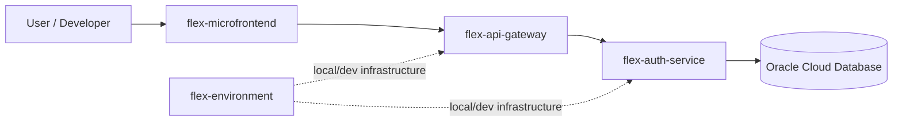
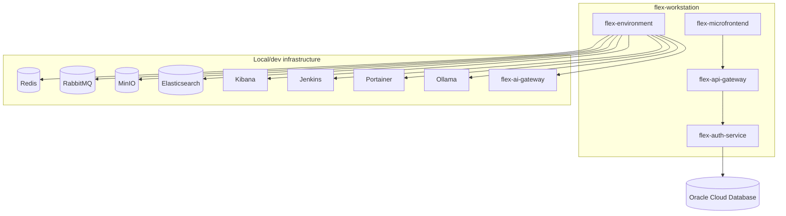

# Bản đồ hệ thống & kiến trúc workstation

Tài liệu này gộp bản đồ cấu trúc `flex-workstation` (repo, bootstrap, tooling) và tổng quan kiến trúc hệ thống Flex ở mức platform/container. Chi tiết nội bộ từng service nên nằm trong `docs/` của repo tương ứng.

## 1. Scope

| Hạng mục | Trạng thái |
| --- | --- |
| Scope | Workstation Flex (`flex-workstation`) và các repo con khai báo trong `workstation.json` |
| Audience | Developer, DevOps, security reviewer, AI agent |
| Architecture style | `Inferred`: multi-repo platform gồm frontend, gateway, backend service và environment stack |
| Primary database (legacy) | `Confirmed by user` (2026-06-18): Oracle Cloud Database — đang trong lộ trình thay thế dần, xem [Data Architecture](#5-data-architecture) |
| Local infrastructure | `Confirmed`: `flex-environment/docker-compose*.yml` |

## 2. Snapshot cấu trúc workstation

```text
flex-workstation/
├── .claude/              # Cấu hình Claude Code; skills dùng junction tới .agents/skills
├── .agents/              # Source runtime dùng chung cho skills Claude Code và Codex
├── .codex/               # Cấu hình Codex CLI
├── .specify/             # Spec Kit runtime, templates, scripts và workflows
├── .vscode/              # VS Code workspace tasks
├── docs/                 # Tài liệu workstation
├── scripts/              # Bootstrap và tooling scripts
├── specs/                # Spec Kit feature specs
├── flex-agents/          # Repo con độc lập - skill/plugin cho coding agents
├── flex-auth-service/    # Repo con độc lập - service xác thực/ủy quyền
├── flex-api-gateway/     # Repo con độc lập - API Gateway
├── flex-microfrontend/   # Repo con độc lập - frontend client
├── flex-environment/     # Repo con độc lập - local/dev infrastructure stack
├── flex-agent-service/   # Repo con độc lập - nền tảng AI Agent đa tenant
├── flex-database/        # Repo con độc lập - migration/schema script dùng chung cho các database
├── AGENTS.md             # Context cho Codex agent
├── CLAUDE.md             # Context cho Claude Code
├── README.md             # Index và hướng dẫn tổng quan
└── workstation.json      # Manifest repo được clone khi bootstrap
```

Các repo con được clone vào trong root này nhưng là Git repo độc lập và được ignore bởi Git của workstation.

## 3. Manifest repo

`workstation.json` là source-of-truth cho danh sách repo được sync bởi bootstrap. Hiện manifest khai báo:

| Repo | URL |
| --- | --- |
| `flex-agents` | `https://github.com/luyenhaidangit/flex-agents.git` |
| `flex-auth-service` | `https://github.com/luyenhaidangit/flex-auth-service` |
| `flex-api-gateway` | `https://github.com/luyenhaidangit/flex-api-gateway.git` |
| `flex-microfrontend` | `https://github.com/luyenhaidangit/flex-microfrontend` |
| `flex-environment` | `https://github.com/luyenhaidangit/flex-environment` |
| `flex-agent-service` | `https://github.com/luyenhaidangit/flex-agent-service.git` |
| `flex-database` | `https://github.com/luyenhaidangit/flex-database` |

Nếu thêm repo mới, thêm entry vào `repositories.items`. Trường `branch` là tùy chọn; nếu không có, script clone theo default branch của remote và pull theo branch hiện tại của repo local.

## 4. Projects

| Project | Vai trò | Công nghệ | Trạng thái |
| --- | --- | --- | --- |
| `flex-agents` | Repository skill/plugin cho coding agents | Markdown, runtime files | `Confirmed` |
| `flex-auth-service` | Service xác thực/ủy quyền | .NET / ASP.NET Core | `Inferred` — xem `flex-auth-service/Flex.Auth.sln`, `SPEC.md` |
| `flex-api-gateway` | API Gateway | .NET, Dockerfile, Jenkinsfile | `Inferred` — xem `flex-api-gateway/Flex.ApiGateway.sln` |
| `flex-microfrontend` | Frontend client | Angular, Node.js | `Confirmed` — xem `flex-microfrontend/README.md`, `package.json` |
| `flex-environment` | Local/dev infrastructure stack | Docker Compose | `Confirmed` — xem `flex-environment/docker-compose*.yml` |
| `flex-agent-service` | Nền tảng AI Agent đa tenant (control plane + runtime) | .NET 9, SignalR | `Confirmed` — xem `specs/000008-agent-platform-mvp/plan.md` |
| `flex-database` | Migration/schema script dùng chung cho các database (MySQL tenant, PostgreSQL shared); đang thay thế dần Oracle | SQL migration scripts; PostgreSQL/pgvector theo [Liquibase SQL-first](liquibase-sql-first.md) | `Confirmed` |

## 5. Data Architecture

| Data store | Vai trò | Trạng thái | Evidence / ghi chú |
| --- | --- | --- | --- |
| Oracle Cloud Database | Primary database lịch sử của hệ thống. | `Confirmed by user` | User xác nhận ngày 2026-06-18: "hiện tại DB đang sử dụng oracle cloud". |
| — Lộ trình thay thế Oracle | Hệ thống Flex đang bỏ Oracle dần, refactor từng repo phụ thuộc sang PostgreSQL/MySQL. | `Confirmed by user` (2026-07-12) | Xem `specs/000005-mysql-tenant-db` (MySQL database-per-tenant), `specs/000008-agent-platform-mvp` (PostgreSQL control plane), `specs/000009-auth-postgres-migration` (migrate `flex-auth-service` khỏi Oracle), repo `flex-database` (kho migration script dùng chung). |
| Oracle local container | Local Oracle DB từng được khai báo trong `flex-environment` nhưng hiện đang comment out. | `Confirmed` | `flex-environment/docker-compose.yml`, `docker-compose.override.yml` có `securitiesdb` bị comment. |
| PostgreSQL `flexdb` | Control plane dùng chung (tenant registry, agent platform). | `Confirmed` | `specs/000005-mysql-tenant-db`, `specs/000008-agent-platform-mvp`. |
| — Vị trí migration của `flexdb` | **Chưa thống nhất** — 3 tiền lệ khác nhau đã xảy ra: bảng ở trên nói `flex-database` là nơi chứa migration dùng chung, nhưng `specs/000008-agent-platform-mvp/plan.md` đặt thực tế tại `flex-environment/migrations/`, còn `specs/000026-agent-catalog` lại đặt tại `flex-agent-service/.../Migrations/`. `docs/architecture/liquibase-sql-first.md` cũng chưa nêu rõ `flexdb` có thuộc phạm vi Liquibase hay không. | `Cần làm rõ` | Mỗi feature động tới `flexdb` PHẢI tự phân tích database/repo đích theo Constitution VI (`.specify/memory/constitution.md`), không suy ra từ dòng trên như một sự thật đã chốt. |
| PostgreSQL (database riêng của `flex-auth-service`) | Datastore identity của `flex-auth-service` sau khi bỏ Oracle — database độc lập, không thuộc `flexdb` control plane. | `Confirmed` | `specs/000009-auth-postgres-migration`. |
| MySQL (database-per-tenant) | Dữ liệu vận hành riêng theo tenant. | `Confirmed` | `specs/000005-mysql-tenant-db`. |
| Qdrant | Vector search cho tri thức agent, filter theo `tenant_id`. | `Confirmed` | `specs/000008-agent-platform-mvp/plan.md`. |
| Redis | Cache/local infrastructure. | `Confirmed` | `flex-environment/docker-compose.yml` khai báo `redisdb`. |
| RabbitMQ | Message broker/local infrastructure. | `Confirmed` | `flex-environment/docker-compose.yml` khai báo `rabbitmq`. |
| MinIO | Object storage/local infrastructure. | `Confirmed` | `flex-environment/docker-compose.yml` khai báo `minio`. |
| Elasticsearch + Kibana | Search/analytics và UI quan sát dữ liệu log/search. | `Confirmed` | `flex-environment/docker-compose.yml` khai báo `elasticsearch`, `kibana`. |

## 6. System Context

> Sơ đồ dưới đây mô tả topology tại thời điểm ghi nhận ban đầu (trước `000008-agent-platform-mvp`/`000009-auth-postgres-migration`) và chưa vẽ lại `flex-agent-service`/`flex-database`. Cập nhật sơ đồ khi các feature đó implement xong và edge thực tế được xác nhận.



## 7. Deployment / Runtime View



## 8. Luồng bootstrap

```text
SYNC_WORKSPACE.cmd
  → scripts\bootstrap.ps1
    → kiểm tra git, VS Code CLI code và winget
    → cấu hình mã hóa UTF-8 cho PowerShell profile
    → cấu hình toàn cục WSL2 (.wslconfig) set localhostForwarding=false
    → kiểm tra runtime config CLAUDE.md, AGENTS.md, .claude, .agents, .codex
    → tạo junction .claude/skills → .agents/skills (source dùng chung, được git track)
    → scripts\sync-repositories.ps1 -PullExisting
      → đọc workstation.json
      → clone repo còn thiếu vào flex-workstation\
      → fetch --prune và pull --ff-only repo đã có nếu working tree sạch
    → kiểm tra/cài ccusage
    → kiểm tra/cài rtk, chạy rtk init nếu cần và apply template Codex RTK từ scripts\templates\rtk-codex.md vào ~\.codex\RTK.md
    → kiểm tra/cài Claude Code nếu thiếu
    → kiểm tra/cài uv và specify-cli
    → initialize Spec Kit nếu .specify\templates chưa có
    → add/update marketplace luyenhaidangit/flex-agents
    → install/update plugin flex-agents@flex-agents
```

Script bỏ qua repo có local changes, origin khác cấu hình hoặc đang ở detached HEAD. Nếu repo có branch khác `branch` trong manifest, script cảnh báo nhưng vẫn pull branch hiện tại.

## 9. Runtime AI tooling

| Tooling | Vị trí | Mục đích |
| --- | --- | --- |
| Claude Code config | `CLAUDE.md`, `.claude/` | Context, settings, hooks, commands và skill runtime cho Claude Code |
| Claude plugin marketplace | `luyenhaidangit/flex-agents` | Cập nhật bộ skill/plugin khi chạy bootstrap |
| Codex agent context | `AGENTS.md` | Context và quy tắc làm việc cho Codex |
| Codex CLI config | `.codex/` | Cấu hình Codex CLI |
| Spec Kit | `.specify/`, `specs/` | Template, workflow và feature specs |
| VS Code tasks | `.vscode/tasks.json` | Shortcut command khi dùng `Terminal: Run Task` trong VS Code |
| `ccusage` | User global CLI | Theo dõi token/cost usage Claude |
| `rtk` | User global CLI | Giảm token output khi chạy shell command |
| `uv` | User global CLI | Cài và quản lý `specify-cli` |
| Workstation config | `workstation.json` | Manifest repo được clone khi bootstrap |

## 10. Source-of-truth

- Tài liệu workstation: `README.md`, `docs/`.
- Manifest repo con: `workstation.json`.
- Runtime config: `CLAUDE.md`, `AGENTS.md`, `.claude/`, `.agents/`, `.codex/`.
- Spec Kit: `.specify/`, `specs/`.
- VS Code task shortcuts: `.vscode/tasks.json`.
- Repo nghiệp vụ: các repo con trong `workstation.json`.

Khi cập nhật hành vi chung trong `CLAUDE.md`, rà lại `AGENTS.md` để Codex có quy tắc tương đương nhưng dùng đúng thuật ngữ/tooling Codex.

## 11. Rủi ro và điểm cần xác minh

| Priority | Vấn đề | Tác động | Khuyến nghị |
| --- | --- | --- | --- |
| High | Chi tiết kết nối Oracle Cloud chưa được tài liệu hóa ở mức architecture. | DevOps/security khó xác minh wallet, secret, network access và rotation trong lúc Oracle vẫn còn dùng ở một số repo. | Bổ sung tài liệu riêng về Oracle Cloud connectivity, không ghi secret vào repo; ưu tiên hoàn tất migration theo `specs/000009-auth-postgres-migration`. |
| Low | Danh sách repo cần được giữ đồng bộ khi thêm/bớt project trong workstation. | AI agent hoặc developer mới có thể hiểu thiếu thành phần nếu tài liệu cũ. | Cập nhật file này (mục 3, 4) khi thay đổi repo trong `workstation.json`; xem checklist `docs/checklists/new-service-checklist.md`. |
| Medium | Quan hệ runtime giữa `flex-api-gateway`, `flex-auth-service` và Oracle Cloud mới ở mức inferred/user-confirmed. | Dễ nhầm giữa ý định kiến trúc và cấu hình triển khai thực tế. | Bổ sung evidence từ app config, connection factory hoặc deployment config của từng service. |
| Medium | Sơ đồ System Context/Deployment (mục 6, 7) chưa vẽ `flex-agent-service`, `flex-database` và các datastore mới (PostgreSQL, MySQL tenant, Qdrant). | Sơ đồ không phản ánh đúng topology sau khi `000008`/`000009` implement xong. | Vẽ lại sau khi các feature đó có deployment thật; đối chiếu `specs/000008-agent-platform-mvp/plan.md` mục "Cấu trúc project". |

## 12. Open Questions

| Câu hỏi | Owner | Impact |
| --- | --- | --- |
| Service nào trực tiếp kết nối Oracle Cloud: `flex-auth-service`, `flex-api-gateway`, hay service khác? | Backend/DevOps | High |
| Oracle Cloud đang dùng Autonomous Database, Base Database Service hay loại khác? | DevOps | Medium |
| Wallet/secret được cấp phát và rotate theo quy trình nào? | DevOps/Security | High |
| `flex-environment` là local-only hay cũng đại diện cho staging/prod topology? | DevOps | Medium |

## 13. Suggested ADRs

| ADR | Decision | Why it matters | Status |
| --- | --- | --- | --- |
| ADR-001 | Dùng Oracle Cloud Database làm primary database (lịch sử) | Ảnh hưởng connection, wallet/secret, backup, migration và local development strategy trước khi bỏ Oracle. | `Superseded` — xem lộ trình thay thế ở mục 5 |
| ADR-002 | Bỏ Oracle dần, chuyển sang PostgreSQL (control plane/shared) + MySQL (database-per-tenant) | Đồng bộ hạ tầng dữ liệu cho các feature multi-tenant mới; loại phụ thuộc Oracle Cloud khỏi toàn hệ thống. | `Proposed` — đang triển khai qua `specs/000005-mysql-tenant-db`, `specs/000008-agent-platform-mvp`, `specs/000009-auth-postgres-migration` |
