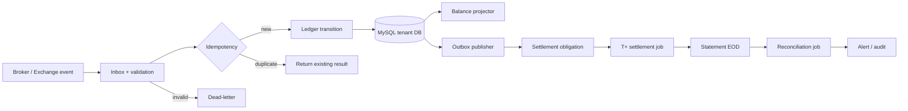

# MVP 08 — Database, pipeline clearing, settlement và đối chiếu

## Mục tiêu

MVP 08 là mốc triển khai database vận hành đầu tiên cho hệ thống. MVP xây nền
dữ liệu bất biến của ledger, pipeline xử lý event có thể retry, sau đó mô phỏng
đúng giai đoạn sau khớp: giao dịch tạo nghĩa vụ trước rồi mới hoàn tất thanh toán
và đối chiếu.

MVP 07 cung cấp quy tắc ledger; MVP 08 triển khai các quy tắc đó thành schema,
migration, service và luồng vận hành. Trước MVP 08, hệ thống chưa có database
ledger vận hành.

## Phạm vi

### Database và dữ liệu nền

- MySQL database-per-tenant cho dữ liệu ledger và settlement vận hành.
- Migration cho `ledger_journal`, `ledger_entry`, `ledger_account`,
  `ledger_balance`, `ledger_inbox`, `ledger_outbox`, `ledger_audit` và
  `settlement_obligation`.
- PostgreSQL shared/control plane chỉ lưu tenant registry, routing database và
  trạng thái pipeline; không lưu chi tiết journal tenant.
- Seed tài khoản opening cho Alpha/Beta và dữ liệu demo có thể lặp an toàn.
- Constraint double-entry, decimal chính xác, tenant scope và unique key chống
  ghi trùng event.

### Pipeline ledger và settlement

- `Inbox` nhận event từ Broker/Exchange với `event_id`, `tenant_id`,
  `source_reference`, `occurred_at` và `correlation_id`.
- Transition factory tạo journal cho opening, reserve, fill, fee và cancel.
- Ghi journal, entries, idempotency và outbox trong một transaction.
- Project balance từ journal sang read model `available`, `reserved`,
  `receivable`, `payable`.
- Tạo `SettlementObligation` từ giao dịch đã khớp.
- Outbox publisher phát `LedgerPosted` và `SettlementCreated` cho consumer tiếp
  theo; hỗ trợ retry, dead-letter và replay.

### Clearing, settlement và đối chiếu

- `ClearingSettlement` ảo nhận giao dịch đã khớp.
- Tạo nghĩa vụ tiền/CK theo broker; day cycle T+ được tua nhanh trong demo.
- Đến T+, chuyển nghĩa vụ đã hoàn tất từ `receivable/payable` sang khả dụng theo
  rule nghiệp vụ.
- Sinh statement EOD giả lập và job đối chiếu tổng, chi tiết, số lượng và giá trị.
- Có chế độ tiêm một lỗi lệch xác định trước để tạo reconciliation alert có
  reference tới giao dịch nguồn.

## Kiến trúc pipeline

## Luồng chính

1. Migration tạo schema tenant và kiểm tra version trước khi service khởi động.
2. Seed opening cho Alpha/Beta, lưu journal `Opening` và tạo balance projection.
3. Event reserve/fill/fee/cancel đi qua inbox, idempotency và transition của MVP
   07; mỗi journal phải cân bằng trước khi commit.
4. Trade ở T tạo `SettlementObligation` và giữ trạng thái tiền/CK là
   `receivable/payable`, chưa khả dụng.
5. Outbox phát sự kiện; consumer settlement cập nhật vòng đời nghĩa vụ theo day
   cycle T+ tua nhanh.
6. Đến T+, settlement job ghi journal hoàn tất, cập nhật projection và phát
   `SettlementCompleted`.
7. Statement EOD giả lập được nạp vào database; reconciliation job đối chiếu
   tổng và chi tiết với ledger.
8. Nếu lệch, tạo alert bất biến có `source_reference`, correlation và trạng thái
   cần xử lý; không tự sửa journal gốc.

## Quy tắc dữ liệu và vận hành

- Journal/entry append-only; sửa sai bằng adjustment hoặc reversal có lý do và
  liên kết journal gốc.
- Unique `tenant_id + source_reference + event_type` ngăn ghi trùng.
- Mọi query balance, trace, obligation và reconciliation đều lọc tenant trước.
- Tiền, giá trị và khối lượng dùng `DECIMAL`/`NUMERIC`, không dùng số thực nhị
  phân.
- Retry exponential backoff tối đa 5 lần; sau đó chuyển dead-letter.
- Có command replay theo `event_id` hoặc sequence; replay không tạo journal mới.
- Có health check cho migration version, inbox/outbox lag, projection sequence,
  dead-letter count và reconciliation backlog.
- Backup/restore được kiểm thử theo tenant trước khi chạy staging.

## API và job tối thiểu

| Thành phần | Mục đích |
|---|---|
| `GET /api/broker/ledger/accounts/{accountId}` | Xem balance theo asset và bucket |
| `GET /api/broker/ledger/trace/{sourceReference}` | Truy vết lệnh/trade tới journal và obligation |
| `POST /api/broker/ledger/adjustments` | Tạo reversal/adjustment có operator và reason |
| `POST /internal/ledger/replay` | Replay event khi recovery |
| `POST /internal/settlement/run` | Tua day cycle T+ trong demo |
| `POST /internal/reconciliation/run` | Chạy đối chiếu statement EOD |
| `GET /internal/ledger/health` | Kiểm tra schema, lag, queue và projection |

## Kịch bản demo

1. Chạy migration và seed Alpha/Beta trên database tenant mới.
2. Tạo lệnh mua/bán, reserve, fill và fee; kiểm tra journal cân bằng.
3. Gửi lại `TradeExecuted`; xác nhận kết quả `duplicate`, không tăng số dư lần hai.
4. Tạo settlement obligation ở T, tua đến T+ và kiểm tra tiền/CK thành khả dụng.
5. Nạp statement EOD đúng, chạy reconciliation và xác nhận trạng thái matched.
6. Tiêm một sai lệch, xác nhận alert có nguồn giao dịch và không sửa journal gốc.
7. Dừng consumer, khởi động lại, xử lý tiếp từ inbox/outbox mà không mất hoặc
   ghi trùng dữ liệu.
8. Thử truy vấn tenant khác; API phải từ chối mà không tiết lộ dữ liệu.

## Điều kiện hoàn thành

- Database migration chạy tự động trên database tenant mới và có version rõ ràng.
- 100% journal được chấp nhận cân bằng trước khi commit.
- Event gửi lặp không tạo journal, obligation hoặc balance delta trùng.
- Projection có thể dựng lại từ journal và cho kết quả giống read model.
- Settlement T+ chuyển đúng trạng thái và tạo trace tới trade nguồn.
- Reconciliation phát hiện được sai lệch tổng và chi tiết trong kịch bản tiêm lỗi.
- Có retry, dead-letter, replay, audit, metric và health check tối thiểu.
- Hoàn tất test backup/restore và permission test chéo tenant ở staging.

## Ngoài phạm vi

- Kết nối VSDC, ngân hàng hoặc file statement thật.
- Margin, collateral, phái sinh và corporate action.
- AI tự động phân loại hoặc tự xử lý chênh lệch.
- Ledger kế toán tổng hợp production và báo cáo pháp định.
