# Speckit Workflow

Luồng làm việc chuẩn với bộ speckit cho `flex-workstation`.

Ghi chú cú pháp: trong Codex, invoke skill bằng `$speckit-*`; trong runtime hỗ trợ
slash command, dùng `/speckit-*`. Hai dạng trỏ tới cùng một bước workflow.

Mọi tác vụ đều bắt đầu từ workflow Speckit đầy đủ, với `$speckit-specify` hoặc
`/speckit-specify` làm bước mô tả nghiệp vụ đầu tiên.

## Sơ đồ luồng

```mermaid
flowchart TD
    START(["Bắt đầu"])

    %% ── SETUP ──────────────────────────────────────
    subgraph SETUP ["⚙️  Setup — chạy một lần cho project"]
        constitution["$speckit-constitution hoặc /speckit-constitution\nThiết lập nguyên tắc dự án"]
    end

    %% ── PER FEATURE ─────────────────────────────────
    subgraph FEATURE ["🔁  Mỗi feature"]
        specify["$speckit-specify hoặc /speckit-specify\n&lt;mô tả nghiệp vụ — chỉ WHAT + WHY&gt;"]

        clarify_gate{Còn mơ hồ?}
        clarify["$speckit-clarify hoặc /speckit-clarify\nTối đa 5 câu làm rõ spec"]

        checklist_gate{Cần validate\nrequirements?}
        checklist["$speckit-checklist hoặc /speckit-checklist domain\nTạo checklist ux / security / api"]

        plan["$speckit-plan hoặc /speckit-plan\n&lt;tech stack + architecture&gt;"]

        tasks["$speckit-tasks hoặc /speckit-tasks\nSinh task list theo dependency"]

        issues_gate{Dùng\nGitHub Issues?}
        taskstoissues["$speckit-taskstoissues hoặc /speckit-taskstoissues\nChuyển tasks → GitHub Issues"]

        analyze_gate{Cần quality\ngate?}
        analyze["$speckit-analyze hoặc /speckit-analyze\nCross-artifact consistency check"]

        implement["$speckit-implement hoặc /speckit-implement\nThực thi tasks từng phase"]

        gap_check{Còn gap\ngiữa code và spec?}
        converge["$speckit-converge hoặc /speckit-converge\nAppend task còn thiếu vào tasks.md"]

        done(["✅ Feature hoàn thành"])
    end

    %% ── EDGES ───────────────────────────────────────
    START --> constitution
    constitution --> specify

    specify --> clarify_gate
    clarify_gate -->|Có| clarify
    clarify_gate -->|Không| checklist_gate
    clarify --> checklist_gate

    checklist_gate -->|Có| checklist
    checklist_gate -->|Không| plan
    checklist --> plan

    plan --> tasks

    tasks --> issues_gate
    issues_gate -->|Có| taskstoissues
    issues_gate -->|Không| analyze_gate
    taskstoissues --> analyze_gate

    analyze_gate -->|Có| analyze
    analyze_gate -->|Không| implement
    analyze --> implement

    implement --> gap_check
    gap_check -->|Có| converge
    gap_check -->|Không| done
    converge --> implement
```



## Bảng commands

| # | Command | Loại | Input | Output |
|---|---------|------|-------|--------|
| 0 | `$speckit-constitution` / `/speckit-constitution` | Core · Setup | Nguyên tắc dự án | `.specify/memory/constitution.md` |
| 1 | `$speckit-specify` / `/speckit-specify` | Core | Mô tả nghiệp vụ (WHAT + WHY) | `specs/<id>/spec.md`, `checklists/requirements.md` |
| 2 | `$speckit-clarify` / `/speckit-clarify` | **Optional** | — | `spec.md` cập nhật (tối đa 5 câu hỏi) |
| 3 | `$speckit-checklist [domain]` / `/speckit-checklist [domain]` | **Optional** | `ux` / `security` / `api` / ... | `checklists/<domain>.md` |
| 4 | `$speckit-plan` / `/speckit-plan` | Core | Tech stack + architecture | `plan.md`, `research.md`, `data-model.md`, `contracts/`, `quickstart.md` |
| 5 | `$speckit-tasks` / `/speckit-tasks` | Core | — | `tasks.md` |
| 6 | `$speckit-taskstoissues` / `/speckit-taskstoissues` | **Optional** | — | GitHub Issues từ `tasks.md` |
| 7 | `$speckit-analyze` / `/speckit-analyze` | **Optional** | — | Report cross-artifact (read-only) |
| 8 | `$speckit-implement` / `/speckit-implement` | Core | — | Code, mark tasks `[X]` |
| 9 | `$speckit-converge` / `/speckit-converge` | Core | — | Append task còn thiếu vào `tasks.md` |

## Ghi chú quan trọng

**`/speckit-specify` vs `/speckit-plan`**
- `specify` = mô tả **nghiệp vụ** — không có tên framework, ngôn ngữ, database.
- `plan` = quyết định **kỹ thuật** — tech stack, architecture đưa vào đây.

**Tránh tạo trùng short-name khi chạy lại `/speckit-specify`**
- Trước khi tạo feature, `specify` dò các thư mục `specs/*-<short-name>`.
- Nếu đã có một thư mục trùng, command hỏi chọn **cập nhật spec hiện có** hoặc **tạo feature mới**; không tự tăng số thứ tự để tạo bản sao.
- Nếu có nhiều thư mục trùng, command liệt kê các thư mục và yêu cầu chọn một thư mục để cập nhật hoặc xác nhận tạo feature mới.

**`/speckit-clarify` nên chạy trước `/speckit-plan`**
Clarify sửa `spec.md` (chi phí thấp). Nếu chạy sau plan, phát hiện assumption sai
sẽ phải làm lại toàn bộ `plan.md`, `data-model.md`, `contracts/`.

**Đồng bộ tài liệu nghiệp vụ**
`speckit-docbiz` được gợi ý qua optional hook sau `speckit-specify` và
`speckit-clarify` để cập nhật tài liệu BA theo `spec.md` mới nhất. Không gắn hook
sau `speckit-converge` vì command đó chỉ append `tasks.md`, không thay đổi scope
hay `spec.md`.

**`/speckit-checklist` là gate cứng của `/speckit-implement`**
Implement tự dừng và hỏi user nếu còn checklist item `[ ]` chưa được tick. Với
`checklists/requirements.md`, item `Status: Không áp dụng` vẫn phải dùng `[x]`:
checkbox xác nhận item đã được review, còn status ghi nhận tiêu chí không áp dụng;
do đó item này không chặn gate.

Artifact mới sinh bởi các lệnh Speckit dùng template canonical trong
`.specify/templates/`. Trong `flex-workstation`, toàn bộ template Speckit được
custom để phần người dùng đọc/review dùng tiếng Việt có dấu, còn các định danh
kỹ thuật như command, file path, API, framework, placeholder, `[P]`, `[Story]`,
`CHK###`, `[Gap]`, `[Spec §X]` vẫn giữ nguyên. Không sửa trực tiếp skill gốc
trong `.agents/skills/**` chỉ để đổi ngôn ngữ artifact.

**`/speckit-converge` lặp với `/speckit-implement`**
Converge chỉ **append** task bổ sung vào `tasks.md`, không sửa gì khác.
Sau converge → chạy lại implement → converge cho đến khi báo "✅ Converged".

## Artifacts sinh ra theo từng feature

```
specs/
└── 000001-ten-feature/
    ├── spec.md              ← /speckit-specify
    ├── plan.md              ← /speckit-plan
    ├── research.md          ← /speckit-plan (phase 0)
    ├── data-model.md        ← /speckit-plan (phase 1)
    ├── quickstart.md        ← /speckit-plan (phase 1)
    ├── contracts/           ← /speckit-plan (phase 1)
    ├── tasks.md             ← /speckit-tasks  (+converge appends)
    └── checklists/
        ├── requirements.md  ← /speckit-specify (auto)
        ├── ux.md            ← /speckit-checklist ux
        └── security.md      ← /speckit-checklist security

.specify/
└── memory/
    └── constitution.md      ← /speckit-constitution
```
