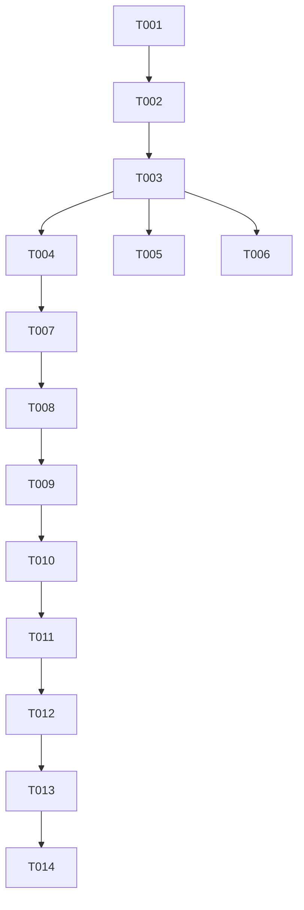

# Tasks: Tùy chọn mã chứng khoán và lưu trạng thái hiển thị trên Market Board

**Đầu vào**: Design documents từ `/specs/000019-multi-symbol-selection/`

**Điều kiện tiên quyết**: [plan.md](file:///c:/Workspace/Project/flex-workstation/specs/000019-multi-symbol-selection/plan.md), [spec.md](file:///c:/Workspace/Project/flex-workstation/specs/000019-multi-symbol-selection/spec.md), [research.md](file:///c:/Workspace/Project/flex-workstation/specs/000019-multi-symbol-selection/research.md), [data-model.md](file:///c:/Workspace/Project/flex-workstation/specs/000019-multi-symbol-selection/data-model.md), [exchange-api-contracts.md](file:///c:/Workspace/Project/flex-workstation/specs/000019-multi-symbol-selection/contracts/exchange-api-contracts.md)

**Format**: `- [x] [ID] [P?] [Story?] Description with path`

---

## Phase 1: Setup (Shared Infrastructure)

**Mục đích**: Khởi tạo hạ tầng lưu trữ tài liệu kỹ thuật cho tính năng.

- [x] T001 Khởi tạo thư mục và cấu trúc tài liệu feature trong `specs/000019-multi-symbol-selection/`

---

## Phase 2: Foundational (Blocking Prerequisites)

**Mục đích**: Chuẩn bị dữ liệu mã chứng khoán mẫu và nâng cấp bộ quản lý Sổ lệnh đa mã ở Backend trước khi làm UI.

- [x] T002 Tạo Liquibase changeset `003-seed-multi-symbols.sql` seed các mã chứng khoán mẫu (`FXS`, `HNX`, `VND`) vào bảng `exchange_instruments` trong `flex-database/hnx/changelog/releases/1.0.0.0/003-seed-multi-symbols.sql`
- [x] T003 Cập nhật `ExchangeService` trong `flex-exchange-service/src/Flex.Exchange.Application/Services/ExchangeService.cs` hỗ trợ `ConcurrentDictionary<string, MatchingEngine>` cho nhiều mã `symbol`

---

## Phase 3: User Story 1 - Chuyển đổi mã chứng khoán trên Market Board (Priority: P1) MVP

**Goal**: Người dùng có thể chọn các mã chứng khoán khác nhau trên Market Board, xem Sổ lệnh & Băng khớp lệnh và đặt lệnh theo mã được chọn.

**Independent Test**:
1. Truy cập `http://localhost:4200/exchange`.
2. Chọn mã `HNX` từ Dropdown.
3. Xác minh Sổ lệnh (OrderBook) và Băng khớp lệnh (Trade Tape) làm sạch và nạp đúng dữ liệu của mã `HNX`.
4. Thực hiện đặt lệnh MUA mã `HNX` thành công.

### Implementation for User Story 1

- [x] T004 [P] [US1] Tạo `InstrumentsController.cs` trong `flex-exchange-service/src/Flex.Exchange.Api/Controllers/InstrumentsController.cs` cung cấp endpoint `GET /api/instruments` trả về danh sách mã chứng khoán `ACTIVE`
- [x] T005 [P] [US1] Cập nhật `OrderBookController.cs` trong `flex-exchange-service/src/Flex.Exchange.Api/Controllers/OrderBookController.cs` nhận parameter `[FromQuery] string? symbol` (mặc định `FXS` khi null)
- [x] T006 [P] [US1] Cập nhật `TradesController.cs` trong `flex-exchange-service/src/Flex.Exchange.Api/Controllers/TradesController.cs` nhận parameter `[FromQuery] string? symbol` (mặc định `FXS` khi null)
- [x] T007 [P] [US1] Cập nhật `ExchangeApiService` trong `flex-microfrontend/src/app/exchange/exchange-api.service.ts` thêm các method `getInstruments()`, `getOrderBook(symbol)`, `getTrades(symbol)`
- [x] T008 [US1] Cập nhật `MarketBoardComponent` HTML trong `flex-microfrontend/src/app/exchange/market-board.component.html` thêm Dropdown bộ chọn mã chứng khoán
- [x] T009 [US1] Cập nhật `MarketBoardComponent` TypeScript trong `flex-microfrontend/src/app/exchange/market-board.component.ts` tự động nạp danh sách mã chứng khoán, tải lại Sổ lệnh, Băng khớp lệnh và gửi lệnh theo `symbol` được chọn (phụ thuộc T007, T008)

**Checkpoint**: User Story 1 hoàn tất, người dùng có thể chọn mã chứng khoán khác nhau và giao dịch độc lập.

---

## Phase 4: User Story 2 - Khôi phục mã chứng khoán đã chọn sau khi làm mới trang (Priority: P1)

**Goal**: Tự động ghi nhớ và khôi phục mã chứng khoán theo thứ tự ưu tiên: URL Query Parameter (`?symbol=...`) ➔ `localStorage` ➔ Default Symbol khi F5 / làm mới trang.

**Independent Test**:
1. Chọn mã `HNX` trên Market Board (`http://localhost:4200/exchange?symbol=HNX`).
2. Nhấn F5 / Reload trang.
3. Xác minh thanh địa chỉ URL vẫn giữ `?symbol=HNX`, Dropdown hiển thị `HNX` và Sổ lệnh nạp đúng dữ liệu `HNX`.

### Implementation for User Story 2

- [x] T010 [P] [US2] Cập nhật `MarketBoardComponent` trong `flex-microfrontend/src/app/exchange/market-board.component.ts` đọc và ưu tiên áp dụng mã từ Angular Router `ActivatedRoute` query parameter (`?symbol=XYZ`) lúc `ngOnInit`
- [x] T011 [US2] Cập nhật `MarketBoardComponent` trong `flex-microfrontend/src/app/exchange/market-board.component.ts` đọc và khôi phục từ `localStorage.getItem('flex_selected_symbol')` khi URL không chứa query parameter (phụ thuộc T010)
- [x] T012 [US2] Cập nhật `MarketBoardComponent` trong `flex-microfrontend/src/app/exchange/market-board.component.ts` tự động đồng bộ mã mới chọn vào `localStorage` và Angular Router `navigate([], { queryParams: { symbol } })` khi chuyển đổi mã trên UI (phụ thuộc T011)

**Checkpoint**: User Story 2 hoàn tất, lựa chọn mã chứng khoán được lưu trữ và khôi phục mượt mà khi reload trang.

---

## Final Phase: Polish & Cross-Cutting Concerns

**Mục đích**: Kiểm thử tổng thể end-to-end và đảm bảo hệ thống ổn định.

- [x] T013 [P] Chạy xác minh manual end-to-end theo các kịch bản trong `specs/000019-multi-symbol-selection/quickstart.md`
- [x] T014 [P] Kiểm tra build & test suite Backend (`dotnet test`) và Frontend (`npm test -- --watch=false`)

---

## Validation Commands

- **Backend Test**: `dotnet test flex-exchange-service/Flex.Exchange.sln`
- **Frontend Test**: `cd flex-microfrontend && npm test -- --watch=false`
- **Liquibase Validate**: `liquibase --changelog-file=flex-database/hnx/changelog/db.changelog-master.xml validate`

---

## Traceability Matrix

| Source Requirement | Task IDs |
| :--- | :--- |
| **US-001** (Chuyển đổi mã chứng khoán) | T004, T005, T006, T007, T008, T009 |
| **US-002** (Khôi phục mã khi reload) | T010, T011, T012 |
| **FR-001** (Dropdown danh sách mã) | T004, T007, T008 |
| **FR-002** (Hiển thị Sổ lệnh/Giao dịch theo mã) | T005, T006, T009 |
| **FR-003** (Đặt lệnh theo mã chọn) | T009 |
| **FR-004** (Ưu tiên đọc từ URL Param / localStorage) | T010, T011 |
| **FR-005** (Đồng bộ URL Param & localStorage) | T012 |
| **BR-002** (Thứ tự ưu tiên khôi phục mã) | T010, T011, T012 |

---

## Dependencies & Execution Order

---

## Implementation Strategy

1. **Phase 1 & 2**: Chuẩn bị dữ liệu Seed Liquibase (`HNX`, `VND`) và bộ quản lý Multi-Engine trong Backend.
2. **Phase 3 (MVP - US1)**: Phát triển API `GET /api/instruments`, nâng cấp `OrderBookController`/`TradesController` và làm Dropdown trên Angular FE.
3. **Phase 4 (US2)**: Kết nối Angular Router `QueryParams` và `localStorage` để tự động khôi phục mã khi F5.
4. **Final Phase**: Chạy kịch bản test end-to-end từ `quickstart.md`.
