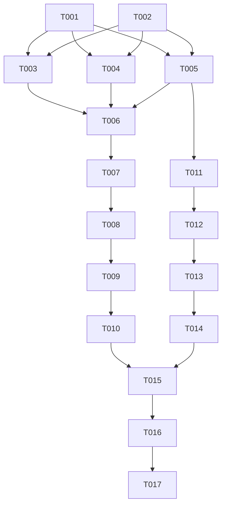

# Task List: Quản lý Vòng đời & Ràng buộc Trạng thái Phiên Giao dịch

**Feature**: `000020-session-lifecycle`  
**Plan**: [plan.md](./plan.md) | **Spec**: [spec.md](./spec.md)  

---

## Task Execution Summary

| Phase | Description | Task Count | Story | Status |
|-------|-------------|------------|-------|--------|
| **Phase 1** | Setup & Infrastructure | 2 | Shared | Completed |
| **Phase 2** | Foundational Domain & Contract Enums | 3 | Prerequisites | Completed |
| **Phase 3** | User Story 1: Chặn Sửa/Hủy & Kiểm soát loại lệnh trong phiên | 5 | [US1] | Completed |
| **Phase 4** | User Story 2: Máy trạng thái 7-phase & Cấu hình lịch phiên per-market | 4 | [US2] | Completed |
| **Phase 5** | Polish, Observability & Integration Verification | 3 | Polish | Completed |

---

## Tasks

### Phase 1: Setup & Infrastructure

- [x] T001 Cập nhật cấu hình thị trường và lịch phiên trong `flex-exchange-service/src/Flex.Exchange.Api/appsettings.json`
- [x] T002 Cấu hình `TradingSessionOptions` hỗ trợ per-market schedule trong `flex-exchange-service/src/Flex.Exchange.Application/TradingSession/TradingSessionOptions.cs`

### Phase 2: Foundational Domain & Contract Enums

- [x] T003 [P] Định nghĩa enum `OrderType` (`LO`, `ATO`, `ATC`) trong `flex-exchange-service/src/Flex.Exchange.Domain/Enums/OrderType.cs`
- [x] T004 [P] Thêm các `RejectReason` mới (`CancelNotAllowedInCurrentSession`, `OrderTypeNotAllowedInCurrentSession`) trong `flex-exchange-service/src/Flex.Exchange.Domain/Enums/RejectReason.cs`
- [x] T005 [P] Mở rộng enum `TradingSessionPhase` chứa 7 phase (`PreOpen`, `ATO`, `Continuous`, `Intermission`, `ATC`, `PLO`, `Close`) trong `flex-exchange-service/src/Flex.Exchange.Domain/TradingSession/TradingSessionState.cs`

### Phase 3: User Story 1 - Chặn Hủy lệnh & Kiểm soát Loại lệnh theo Phiên

- [x] T006 [US1] Thêm các phương thức `IsAllowingCancel(market)` và `IsOrderTypeAllowed(market, orderType)` vào interface `flex-exchange-service/src/Flex.Exchange.Application/TradingSession/ISessionService.cs`
- [x] T007 [US1] Triển khai van chặn cancel và kiểm tra orderType trong `flex-exchange-service/src/Flex.Exchange.Application/TradingSession/SessionService.cs`
- [x] T008 [US1] Cập nhật `ExchangeService` gọi `SessionService.IsAllowingCancel` trước khi hủy lệnh và truyền `orderType` trong `flex-exchange-service/src/Flex.Exchange.Application/Services/ExchangeService.cs`
- [x] T009 [US1] Cập nhật `OrdersController` nhận `orderType` từ `PlaceOrderRequest` trong `flex-exchange-service/src/Flex.Exchange.Api/Controllers/OrdersController.cs`
- [x] T010 [US1] Bổ sung unit & integration test kiểm thử từ chối hủy lệnh trong ATO/ATC và từ chối loại lệnh không phù hợp trong `flex-exchange-service/tests/Flex.Exchange.Api.Tests/OrdersApiTests.cs`

### Phase 4: User Story 2 - Máy trạng thái 7-phase & Lịch phiên per-market

- [x] T011 [US2] Mở rộng logic `TradingSessionState` hỗ trợ chuyển đổi 7 phase và bỏ qua ATO/PLO theo cấu hình trong `flex-exchange-service/src/Flex.Exchange.Domain/TradingSession/TradingSessionState.cs`
- [x] T012 [US2] Đảo ngược thứ tự ghi CSDL trước khi mutate in-memory state trong `flex-exchange-service/src/Flex.Exchange.Application/TradingSession/SessionService.cs`
- [x] T013 [US2] Triển khai vòng lặp `SessionWorker` chạy 7 phase per-market kèm retry ghi CSDL trong `flex-exchange-service/src/Flex.Exchange.Api/HostedServices/SessionWorker.cs`
- [x] T014 [US2] Cập nhật unit test `TradingSessionStateTests` bao phủ 7 phase và các sơ đồ chuyển phiên của HOSE, HNX, UPCoM, Phái sinh trong `flex-exchange-service/tests/Flex.Exchange.Domain.Tests/TradingSessionStateTests.cs`

### Phase 5: Polish & Cross-Cutting Concerns

- [x] T015 Thêm log `Critical` khi retry ghi CSDL thất bại và log `Warning` khi van chặn từ chối lệnh trong `flex-exchange-service/src/Flex.Exchange.Application/TradingSession/SessionService.cs`
- [x] T016 Chạy lại toàn bộ test suite `dotnet test flex-exchange-service/Flex.Exchange.sln` để đảm bảo 100% test pass
- [x] T017 Xác minh tích hợp với Frontend Angular client trong `flex-microfrontend/src/app/exchange/market-board.component.ts`

---

## Dependencies & Completion Order

---

## Implementation Strategy (MVP Scope)

- **MVP Increment**: Triển khai Phase 1, Phase 2, và Phase 3 (US-001) trước để chốt quy tắc cấm sửa/hủy lệnh trong ATO/ATC.
- **Full Scope**: Tiếp tục thực hiện Phase 4 (US-002) và Phase 5 để hoàn thiện máy trạng thái 7-phase cho cả 4 thị trường.
